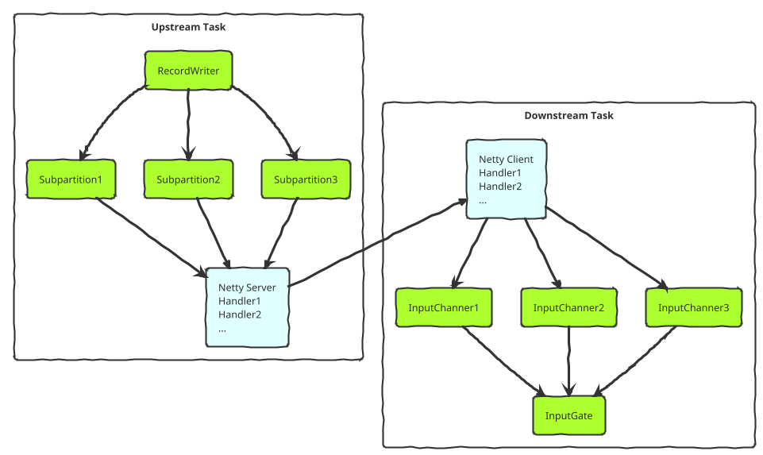
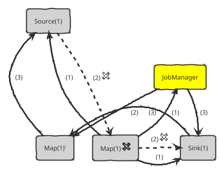
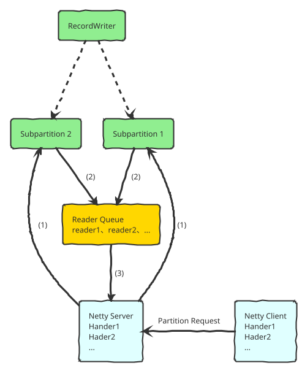
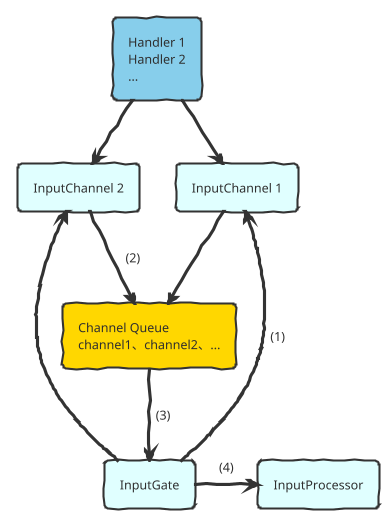
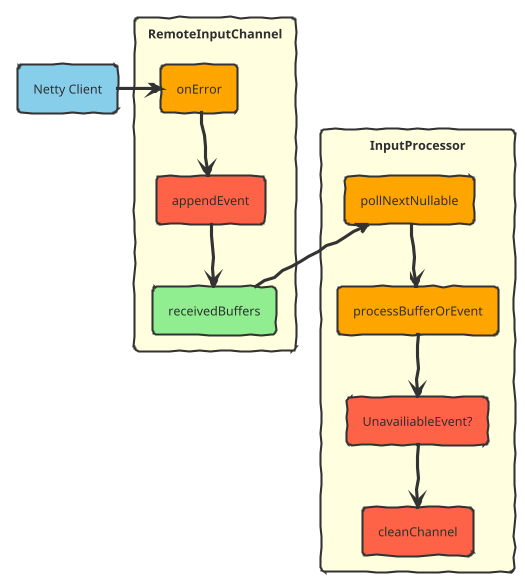
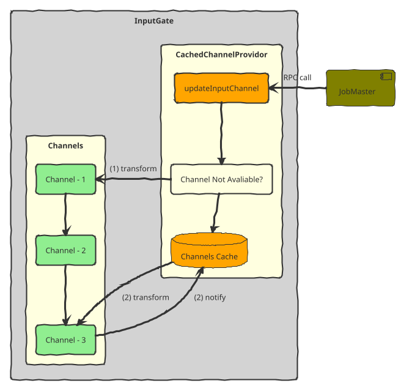
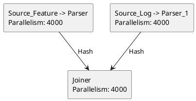

## 解决实时场景下数据断流问题

在我们的实时计算场景中，我们有很多任务（数量2k+）会直接服务于线上，其输出时延和稳定性会直接影响线上产品的用户体验，这类任务通常具有如下特点：

- 流量大，并发高（最大的任务并行度超过 1w）
- 拓扑类似于多流 Join，将各个数据源做整合输出给下游，不依赖 Checkpoint
- 对短时间内的小部分数据丢失不敏感（如 0.5%），但对数据输出的持续性要求极高

在 Flink 现有的架构设计中，多流 Join 拓扑下单个 Task 失败会导致所有 Task 重新部署，耗时可能会持续几分钟，这对于线上业务来说是不可接受的。

针对这一痛点，我们提出单点恢复的方案，通过对 network 层的增强，使得在机器下线或者 Task 失败的情况下，以短时间内故障 Task 的部分数据丢失为代价，达成以下目标：

- 作业不发生全局重启，只有故障 Task 发生 Failover
- 非故障 Task 不受影响，正常为线上提供服务

## 解决思路

当初遇到这些问题的时候，我们提出的想法是说能不能在机器故障下线的时候，只让在这台机器上的 Tasks 进行 Failover，而这些 Tasks 的上下游 Tasks 能恰好感知到这些 Failed 的 Tasks，并作出对应的措施：

- 上游：将原本输出到 Failed Tasks 的数据直接丢弃，等待 Failover 完成后再开始发送数据。
- 下游：清空 Failed Tasks 产生的不完整数据，等待 Failover 完成后再重新建立连接并接受数据

根据这些想法我们思考得出几个比较关键点在于：

- 如何让上下游感知 Task Failed ?
- 如何清空下游不完整的数据 ?
- Failover 完成后如何与上下游重新建立连接 ?

## 当前架构

**注：我们的实现基于 Flink-1.9，1.11 后的网络模型加入了 Unaligned Checkpoint 的特性，可能会有所变化。**

我们先将 Flink 的上下游 Task 通信模型简单抽象一下：

上下游 Task 感知彼此状态的逻辑，分三种情况考虑：

- Task因为逻辑错误或OOM等原因Fail，Task自身会主动释放 network resources，给上游发送 channel close 信息，给下游发送 Exception。
- TaskManager 进程被 Yarn Kill，TCP 连接会被操作系统正常关闭，上游 Netty Server 和下游 Netty Client 可以感知到连接状态变化。
- 机器断电宕机，这个情况下操作系统不会正确关闭 TCP 连接，所以 Netty 的 Server 和 Client 可能互相感知不到，这个时候我们在 deploy 新的 Task 后需要做一些强制更新的处理。

可以看到，在大部分情况下，Task 是可以直接感知到上下游 Task 的状态变化。了解了基础的通信模型之后，我们可以按照之前的解决思路继续深入一下，分别在上游发送端和下游接收端可以做什么样改进来实现单点恢复。

## 优化方案

根据我们的解决思路，我们来绘制一下单个 Task 挂了之后，整个 Job 的通信流程：

Map(1) 失败之后：

1. 将 Map(1) 失败的信息通知 Source(1) 、Sink(1) 和 JobManager。
2. JobManager 开始申请新的资源准备 Failover，同时上游 Source(1) 和下游 Sink(1) 切断和 Map(1) 的数据通道，但是 Source(1) 和 Sink(1) 和其他 Task 的数据传输仍正常进行。
3. Map(1)' 被成功调度，和上游建立连接，JobManager 通知 Sink(1) 和 Map(1)' 建立连接，数据传输通道被恢复。

从这个流程，我们可以将优化分为三个模块，分别为上游发送端、下游接收端和 JobManager。

### 上游发送端的优化

我们再细化一下上游发送端的相关细节，

1. Netty Server 收到 Client 发送的 Partition Request 后，在对应的 Subpartition 注册读取数据的 SubpartitionView 和 Reader。
2. RecordWriter 发送数据到不同的 Subpartitions，每个 Subpartition 内部维护一个 buffer 队列，并将 读取数据的 Reader 放入到 Readers Queue 中。（Task 线程）
3. Netty 线程读取 Readers Queue，取出对应的 Reader 并读取对应 Subpartition 中的 buffer 数据， 发送给下游。（Netty 线程）

我们的期望是上游发送端在感知到下游 Task 失败之后，直接将发送到对应 Task 的数据丢弃。那么我们的改动逻辑，在这个示意图中，就是 Subpartition 通过 Netty Server 收到下游 Task Fail 的消息后，将自己设置为 Unavailable，然后 RecordWriter 在发送数据到指定 Subpartition 时，判断是否可用，如果不可用则直接将数据丢弃。而当 Task Failover 完成后重新与上游建立连接后，再将该 Subpartition 置为 Available，则数据可以重新被消费。

发送端的改动比较简单，得益于 Flink 内部对 Subpartition 的逻辑做了很好的抽象，并且可以很容易的通过参数来切换 Subpartition 初始化的类型，我们在这里参考 PipelinedSubpartition 的实现，根据上述的逻辑，实现了我们自己的 Subpartition 和对应的 View。

### 下游接收端的优化

同样，我们来细化一下下游接收端的细节：

仔细来看，其实和上游的线程模型颇有类似之处：

1. InputGate 初始化所有的 Channel 并通过 Netty Client 和上游 Server 建立连接。
2. InputChannel 接收到数据后，缓存到 buffer 队列中并将自己的引用放入到 Channels Queue 里。 （Netty 线程）
3. InputGate 通过 InputProcessor 的调用，从 Queue 里拉取 Channel 并读取 Channel 中缓存的 buffer 数据，如果 buffer 不完整（比如只有半条 record），那么则会将不完整的 buffer 暂存到 InputProcessor 中。（Task 线程）

这里我们期望下游接收端感知到上游 Task 失败之后，能将对应 InputChannel 的接收到的不完整的buffer直接清除。不完整的 buffer 存储在 InputProcessor 中，那么我们如何让 InputProcessor 知道哪个 Channel 出现了问题？

简单的方案是说，我们在 InputChannel 中直接调用 InputGate 或者 InputProcessor，做 buffer 清空的操作，但是这样引入一个问题，由于 InputChannel 收到 Error 是在 Netty 线程，而 InputProcessor 的操作是在 Task 线程，这样跨线程的调用打破了已有的线程模型，必然会引入锁和调用时间的不确定性，增加架构设计的复杂度，并且因为 InputProcessor 会对每一条 record 都有调用，稍有不慎就会带来性能的下降。

我们沿用已有的线程模型，Client 感知到上游 Task 失败的消息之后告知对应的 Channel，Channel 向自己维护的 receivedBuffers 的末尾插入一个 UnavailableEvent，并等待 InputProcessor 拉取并清空对应 Channel 的 buffer 数据。示意图如下所示，红色的模块是我们新增的部分：

### JobManager 重启策略的优化

JobManager 重启策略可以参考社区已有的 RestartIndividualStrategy，比较重要的区别是，在重新 deploy 这个失败的 Task 后，我们需要通过 ExecutionGraph 中的拓扑信息，找到该 Task 的下游 Tasks，并通过 Rpc 调用让下游 Tasks 和这个新的上游 Tasks 重新建立连接。

这里实现有一个难点是如果 JobManager 去 update 下游的 Channel 信息时，旧的 Channel 对应的 buffer 数据还没有被清除怎么办？我们这里通过新增 CachedChannelProvider 来处理这一逻辑：

如图所示，以 Channel - 1 为例，如果 JobManager 更新 Channel 的 Rpc 请求到来时 Channel 处于不可用状态，那么我们直接利用 Rpc 请求中携带的 Channel 信息来重新初始化 Channel。以 Channel - 3 为例，如果 Rpc 请求到来时 Channel 仍然可用，那么我们将 Channel 信息暂时缓存起来，等 Channel - 3 中所有数据消费完毕后，通知 CachedChannelProvider，然后再通过 CachedChannelProvider 去更新 Channel。

这里还需要特别提到一点，在字节跳动内部我们实现了预留 TaskManager 的功能，当 Task 出现 Failover 时，能够直接使用 TaskManager 的资源，大大节约了 Failover 过程数据丢失的损耗。

### 实现中的关键点

整个解决的思路其实是比较清晰的，相信大家也比较容易理解，但是在实现中仍然有很多需要注意的地方，举例如下：

- 上面提到 JobManager 发送的 Rpc 请求如果过早，那么会暂时缓存下来等待 Channel 数据消费完成。而此时作业的状态是未知的，可能一直处于僵死的状态（比如卡在了网络 IO 或者 磁盘 IO 上），那么 Channel 中的 Unavailable Event 就无法被 InputProcessor 消费。这个时候我们通过设置一个定时器来做兜底策略，如果没有在定时器设置的时间内完成 Channel 的重新初始化，那么该 Task 就会自动下线，走单点恢复的 Failover 流程。
- 网络层作为 Flink 内线程模型最复杂的一个模块，我们为了减少改动的复杂度和改动的风险，在设计上没有新增或修改 Netty 线程和 Task 线程之间通信的模型，而是借助于已有的线程模型来实现单点恢复的功能。但在实现过程中因为给 Subpartition 和 Channel 增加了类似 isAvailable 的状态位，所以在这些状态的修改上需要特别注意线程可见性的处理，避免多线程读取状态不一致的情况发生。

## 收益

目前单点恢复功能已经上线了 1000+ 作业，在机器下线、网络抖动等情况下，效果非常明显。以下面这个作业拓扑为例，在作业正常运行时我们手动 Kill 一个 Container，来看看不同并行度作业开启单点恢复的效果：

我们在 1000 和 4000 并行度的作业上进行测试，每个 slot 中有 2 个 Source 和 1 个 Joiner 共 3 个 Task，手动 Kill 一个 Container 后，从故障恢复时间和断流影响两个维度进行收益计算：

|                        | 并行度 = 1000（TM=250, SlotsPerTM = 4）                      | 并行度 = 4000（TM=1000, SlotsPerTM = 4）                     |
| ---------------------- | ------------------------------------------------------------ | ------------------------------------------------------------ |
| 不开启单点恢复         | **恢复时间：作业全局重启耗时 40s断流影响：重启过程中作业输出完全断流 40s** | **恢复时间：作业全局重启耗时 81s，断流影响：重启过程中作业输出完全断流 81s** |
| 单点恢复（不预留资源） | **恢复时间：12 个 Task 进行 Failover，耗时 20s断流影响：上游输出减少 4/4000 = 1‰，持续 20s** | **恢复时间：12 个 Task 进行 Failover，耗时 18s 断流影响：上游输出减少 4/4000 = 1‰，持续 18s** |
| 单点恢复（预留资源）   | **恢复时间：12 个 Task 进行 Failover，耗时 5s断流影响：上游输出减少 4/4000 = 1‰，持续 5s** | **恢复时间：12 个 Task 进行 Failover，耗时 5s断流影响：上游输出减少 4/4000 = 1‰，持续 5s** |

结论：可以看到，在 4000 个 Slot 的作业里，如果不开启单点恢复，作业整体的 Failover 时间为 81s，同时**对于下游服务来说，上游服务断流 81s**，这在实时服务线上的场景中明显是不可接受的。而开启了单点恢复和预留资源后，Kill 1 个 Container 只会影响 4 个 Slot，且 Failover 的时间只有 5s，同时**对于下游服务来说，上游服务产生的数据减少 4/4000=千分之一，持续 5s**，效果是非常显而易见的。
