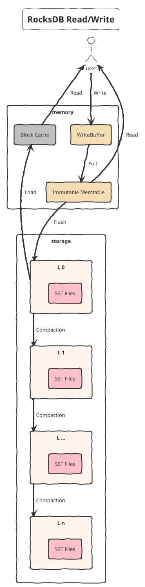

## 性能优化

**单条记录的 State Size 过大**、**Operator 内部的 RocksDB 容量过大**(比如大于15G)等场景会导致频繁Compaction，并且造成 RocksDB 频繁的 Write Stall

### 提升state性能

- 通过ColumnFamilyOptions.setCompressionType(CompressionType.NO_COMPRESSION) 将压缩关闭，采用磁盘空间容量换 CPU 的方式来减少 CPU 的损耗
- 开启 RocksDB 的 bloom-filter
- 写少读多的场景，可以调大Cache来减少磁盘 IO

**优化序列化的开销**

- 使用更精简的数据结构，去除不需要存储的字段，比如尝试为RoaringBitmap实现自定义序列化器
- StateDescriptor 中通过自定义 Serializer 来减小序列化开销
- 在 KryoSerializer 显式注册 PB/Thrift Serializer
- 减小 State 的操作次数
- 在 StateBackend 和 Operator 中间构建 StateBackend Cache Layer，缓存热点数据，并且根据 GC 情况进行动态扩缩容

### 降低checkpoint耗时

**减少 Barrier 对齐时间**

核心是降低 in-flight 的 Buffer 总大小。可以通过 `taskmanager.network.memory.max-buffers-per-channel` 限制单个 channel 的最大 Buffer 数量

**降低 DFS 压力**

- 可以调大 `state.backend.fs.memory-threshold` 来减少 DFS 文件数量
- 合理设置制作快照时上传和恢复快照时下载 RocksDB 状态文件的线程数 `state.backend.rocksdb.checkpoint.transfer.thread.num`。比如超过10时，快照制作和快照恢复都会给 DFS(尤其是NameNode) 带来非常大的瞬时压力
- 减少RocksDB 目录下的文件数量，可以调大 `state.backend.rocksdb.writebuffer.size`，或者合并小文件 [FLINK-11937](https://issues.apache.org/jira/browse/FLINK-11937) 
