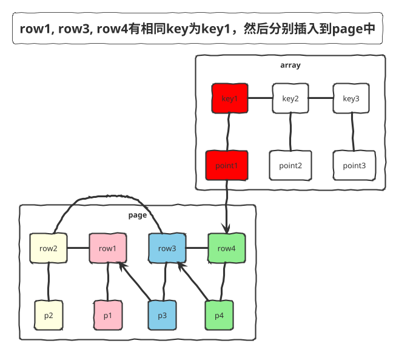

## 原理

根据执行过程中的中间数据优化后续执行，从而提高整体执行效率。核心在于两点
1. 执行计划可动态调整
2. 调整的依据是中间结果的精确统计信息

AQE会为每个stage单独创建一个子job `QueryStage`，执行完后收集该stage相关的统计信息（主要是数据量和记录数），并依据这些统计信息优化调整下一个stage的执行计划。

## 功能点

### 自动调整shuffle partition number

子job先按照 `spark.sql.adaptive.maxNumPostShufflePartitions=500` 设置的数量来生成reduce tasks，子job执行完后收集统计信息得到各个reduce tasks的数据量byteSize及记录数rowCount。然后根据reduce task id顺序遍历task，把数据量小的task合并成一个task执行，多个task合并成一个task的标准是：合并的tasks总数据量 < `spark.sql.adaptive.shuffle.targetPostShuffleInputSize=64m` 并且总记录数 < `spark.sql.adaptive.shuffle.targetPostShuffleRowCount=20000000`，从而达到调整shuffle partitions数量的目的。

### 自动调整join相关执行计划：SortMergeJoin调整为BroadcastJoin

如果某一个stage shuffle数据量 < `spark.sql.adaptiveBroadcastJoinThreshold` (默认为 `spark.sql.autoBroadcastJoinThreshold`)，就将执行计划由SortMergeJoin调整为BroadcastHashJoin。

### 处理join操作的数据倾斜

如果某一个partition的数据量或者记录条数超过task shuffle write数据量中位数的 `spark.sql.adaptive.skewedPartitionFactor` 倍，并且大于阈值 `spark.sql.adaptive.skewedPartitionSizeThreshold`, `spark.sql.adaptive.skewedPartitionRowCountThreshold`，则认为这是一个数据倾斜的partition。

假设A表和B表做inner join，并且A表中第0个partition是一个倾斜的partition，使用N个任务去处理该partition。每个任务只读取若干个map的shuffle 输出文件，然后读取B表partition 0的数据做join。最后，将N个任务join的结果通过Union操作合并起来。在这样的处理中，B表的partition 0会被读取N次，虽然这增加了一定的额外代价，但是通过N个任务处理倾斜数据带来的收益仍然大于这样的代价。如果B表中partition 0也发生倾斜，对于inner join也可以将B表的partition 0分成若干块，分别与A表的partition 0进行join，最终union起来。

### 自动调整join相关执行计划：SortMergeJoin调整为ShuffledHashJoin (内部功能)

如果每个partition的数据量都小于等于 `spark.sql.adaptiveHashJoinThreshold=50m`，则将执行计划由SortMergeJoin调整为ShuffledHashJoin，调整后会消除原来耗时的排序过程。

### left join build left side (内部功能)

在使用ShuffledHashJoin执行引擎完成left join操作时，默认只能将right side作为hash join的build side。在right side结果集较大无法使用ShuffledHashJoin时，可使用build left side的方案将SortMergeJoin优化成ShuffledHashJoin。

现有的left join执行时，将right端build到hash map中，原理如下：将数据（key, row）添加到底层数据结构LongToUnsafeRowMap (包含存放key的数组array和存放row的数组page) 中时，先将row直接存入page数组的尾部（紧邻上一条数据记录）。然后通过key的hash code找到key在array数组中的位置，如果是第一次出现的key，则array中直接保存该key及对应的row在page中的pointer(offset|size)信息，否则还需要先将array中该key对应的pointer信息（该key上一个row的pointer信息）更新到page中，然后将当前插入到page中的row的pointer更新到array数组中该key对应的位置上，即array中保存的始终是key最新插入到page中的那条row数据的pointer。



**Build hash map with left side**

修改底层数据结构LongToUnsafeRowMap中存放key信息的array数组，在存入key信息时增加一个标志位，用于标记在join操作时right端是否有记录匹配到了该key，0表示未匹配，1表示匹配，build hash map时所有key的该标志位置为0。

**Left join operation（A left join B）**

遍历right side的所有记录，通过key的hash code在array数组中寻找该key相关的记录，如果能匹配到相应的记录，则进行join操作并修改array中该key对应的标志位为1。join操作输出的结果集记为R1；在完成right side端所有记录的遍历后，遍历array数组，找出所有标志位为0的key及在page数组中对应的rows，将这些记录与null Row进行join生成结果集R2；之后合并结果集R1和结果集R2，输出最终生成的join结果R。

## SkewedJoin

假设A表和B表做inner join，并且A表中第0个partition是一个倾斜的partition，使用N个任务去处理该partition。每个任务只读取若干个map的shuffle 输出文件，然后读取B表partition 0的数据做join。最后，将N个任务join的结果通过Union操作合并起来。在这样的处理中，B表的partition 0会被读取N次，虽然这增加了一定的额外代价，但是通过N个任务处理倾斜数据带来的收益仍然大于这样的代价。如果B表中partition 0也发生倾斜，对于inner join也可以将B表的partition 0分成若干块，分别与A表的partition 0进行join，最终union起来。

**生效条件**

- Join物理算子类型：只针对SortMergeJoin 和 ShuffleHashJoin。对于 BroadcastHashJoin 无法生效
- 不支持outer join，对于left join不支持right表的数据倾斜优化
- 取决于Join Pattern
  - Normal Join：SortMergeJoin且两边都是Sort + Exchange的组合
  - JoinWithAgg: SortMergeJoin且一边有Agg，则该侧不支持
  - MultipleJoin：SortMergeJoin且一边有Join，则依赖该侧是否支持数据倾斜优化
  - MultipleJoinWithAggOrWin：SortMergeJoin且一边有HashAgg，则该侧不支持
  - SkewedJoinWithUnion：两个SortMergeJoin的Union，则不支持

### 其他方法

**加盐去盐**

```sql
-- 关联为null或空字符串的key gid，在join之前先加盐
select case gid is not null and gid <> '' then gid
    else concat(cast(floor(rand() * 10000) as string), 'unknown')
    end as gid
```

**先filter后join，再union filter**

```sql
select a.gid, b.score
from a where a.gid is not null and a.gid <> ''
left join b on a.gid = b.gid
union all
select a.gid, null as score
from a where a.gid is null or a.gid = '';
```
