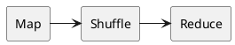

## Shuffle

**会产生shuffle的算子**

| Repartition | ByKey         | Join          | Distinct |
| ----------- | ------------- | ------------- | -------- |
| repartition | groupByKey    | cogroup       | distinct |
| coalesce    | reduceByKey   | join          |          |
|             | aggreateByKey | leftOuterJoin |          |
|             | combineByKey  | intersection  |          |
|             | sortByKey     | subtract      |          |
|             | sortBy        | subtractByKey |          |
