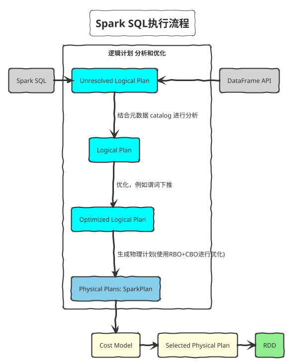

## 执行流程



## 优化器

### RBO (Rule-based Optimizer)

- 根据关系代数等价语义，重写查询
- 基于启发式规则
- 访问表的元数据catalog，不会涉及具体的表数据data

**列裁剪**：scan尽可能少的列
**谓词下推**：尽可能早地filter行
**传递闭包**: 施加逻辑约束，比如推导左表的筛选条件给右表

### CBO (Cost-based Optimizer)

- 使用一个模型估算执行计划的代价，选择代价最小的执行计划
- 计算算子代码：计算代价 CPU/内存、读取代价 磁盘I/O、传输代价 Network I/O
- 统计原始表数据信息(输入算子)：表或分区级别的行数和行平均大小，列级别的minmax、count null、count ditinct、histogram等
- 推导信息(中间算子)：算子需要处理的**准确**的数据行数 cardinality；过滤条件的过滤比例 selectivity

统计信息一般**假设列与列之间是独立的，但是这个假设经常与现实不符**

## 优化方法

### 算子下推 Operator Push Down

数据库常用优化方式，将上层算子节点尽量下推，靠近叶子结点，达到减少后续处理的数据量甚至简化后续的处理逻辑。比如列剪裁，只读取查询语句中涉及到的列。

#### 谓词下推 PushDownPredicate

如果底层数据源在进行扫描时能非常快速的完成数据的过滤，那么就会把过滤交给底层数据源来完成，这就是谓词下推。

```sql
select a.name, b.score from a join b on a.id = b.id
where a.age > 18 and b.score >= 90
```

```plantuml

```

#### HashAggregate预聚合 

stage中的partial_count，直接在读取数据本地进行预聚合，适用于count聚合

### 算子组合 Operator Combine

将能够组合的算子尽量整合在一起，避免重复计算，提高性能。

### 常量折叠和长度消减 Constant Folding and Strength Reduction

涉及常量的节点在实际处理之前完成静态处理。
