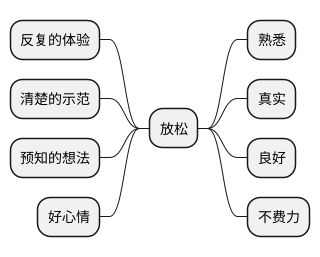

# 序言
> 办公室饮水机旁的闲谈

可得性法则：依靠记忆作出判断

# 系统1和系统2

## 无意识运作的系统1
> 通过联想记忆不断地对世界所发生的的事作出连贯性解释

自主发生且毫不费力

#### 视觉错觉和认知错觉

系统1产生的成见，可以由系统2识别。在风险很高的决策场景，尽力避免这些错误

## 受控制运作的系统2

脑力工作，需要刻意，努力并且有序进行。需要集中注意力，如若注意力分散，运作也会随之中断

系统1不断为系统2提供印象，直觉，意向，感觉等信息。如果系统2接收了这些信息，则会将印象，直觉等转变为信念，将冲动转化为自主行为

#### `看不见的大猩猩`

> 观看一部两队分别穿黑色和白色球衣的篮球队的比赛视频，并数出白队的传球次数，中途有一个套着大猩猩服装的女人穿过球场，这个大猩猩出现了足足9秒。但是最终有一半人未察觉到那只猩猩

当人们太过关注某件事时，就会屏蔽掉其他事情，即使平时很感兴趣也不例外

#### 瞳孔-大脑运转情况的灵敏指示器

在解决费脑问题时会扩散，并且问题越难，扩散得越大。最大扩散50%，心跳+7，超过此极限，就会自动放弃，此时瞳孔就会停止扩散或收缩

四位数逐位加一和加三

## 惰性思维与延迟满足

惰性思考和做不到延迟满足的人：系统2的监测功能往往较弱

自我控制需要集中注意力，需要付出努力，即需要用到系统2

#### 心流

将大脑注意力毫不费力地集中起来的状态

可以使人忘却时间的概念，忘掉自己，也忘掉自身问题

#### 自我损耗 `ego depletion`

自我控制(也包括其他活动如审慎的选择，主动性行为等)，在短期内只能进行有限次，消耗后就会很不情愿或根本无法进行自我控制。自我损耗的影响可以通过注射葡萄糖得到缓解

**实验**：抑制自己的感情去看一部感情共鸣的电影，然后做耐力测试，会表现很差

#### 理性和反思性思维

系统2的两个部分智力和理性

**算法思维**：负责要求很高的计算活动，智力体现
**理性思维**：相较于算法思维，理性思维可以消除成见

## 连贯性联想

#### 联想激活

事物在大脑中唤起的想法激发出许多其他的连贯性的想法，其中每个环节都是紧密相连，相互支持的，形成一种认知、情感和生理反应的自我强化模式

#### 启动效应

由于之前受某一刺激的影响而使得之后对同一刺激的知觉和加工变得容易的记忆现象

**John Bargh实验**：从单词中组句，组句有一半都含有老年相关词汇的的小组，在紧接着走路时步速会变慢，反之亦然，即先慢慢走路，然后能更快辨识老年相关词汇

**关于钱会滋生个人主义的实验**：在桌子上放仿制纸币或美钞壁纸的环境下，要求解决问题。脑海有钱这一概念的小组，会更独立，实在迫不得已才会向研究人员求租，表明其自力更生能力的提升；也会更自私，不愿花时间帮助另外一位假装不会做的学生，研究人员的铅笔掉地上，也更少帮忙捡起，帮过一会儿要交谈的对象摆放椅子时，也会摆放得远一点

## 有可能只是错觉的直觉

#### 认知放松度

认知紧张：存在某种问题需要不断调度系统2参与其中。认知紧张更有可能激发系统2来抑制系统1的直觉性答案

#### 曝光效应 `Mere Exposure Effect`

个体接触一个刺激的次数越频繁，个体对该刺激就越喜欢

一个刺激的的重复曝光并没有产生不好的影响，这样的刺激最终变成安全的信号，即能使机体鉴别出安全的物品和栖息地

#### 远隔联想测验 `Remote Association Test`

创新是极佳的联想记忆。好心情，直觉，创造力、轻信以及对系统1不断增强的依赖性形成了一个关联群集。悲伤、警觉、怀疑、分析方法以及不断增强的努力程度等因素之间也是相互联系的

**实验**：给三个词在15s内想出与之都有关的词，以及2s内判断两个词是否有关联

## 意料之外与情理之中

#### 因果性直觉

人们总是很不恰当地将因果性思考用于需要统计论证的情景中。统计性思维总是根据事物的不同类别和总体性质得出个案的结论。系统1并不具备这样的推理能力，而系统2通过学习可以进行统计性思考

## 直觉的一致性

#### 光环效应 `Halo Effect`

在人际知觉中所形成的以点概面或以偏概全的主观印象。光环效应注重第一印象

**Solomon Asch 所罗门阿希实验**：要求对两个人的个性进行描述，艾伦 `聪明-勤奋-冲动--爱挑剔-固执-忌妒心强`，本 `忌妒心强-固执-爱挑剔--冲动-勤奋-聪明`

#### 群体的智慧 `The Wisdom of Crowds`

一群没有系统性偏见的相互独立的观察者作出的判断进行平均之后得到的平均值会趋近于准确值

独立判断原则和解除错误关联，可以直接应用于群体会议

#### 眼见即为事实 `What you see is all there is`

系统1基本上对引起印象和直觉的信息的质量和数量都不敏感。信息的前后一致性胜于其完整性

## 直觉性判断
> 系统1通过原型或一组典型事例来代表不同事物分类

系统1更容易比较两个物品的长宽高和估计平均值，以及强度等级匹配，而需要调度系统2来算总数总长

**思维的发散性**：系统1任何时候都可以同时进行多种估算，其中有些估算是持续不间断的常规评估。大脑会对视觉范围内呈现出的立体事物进行评估，对形状、空间位置和特性等因素的全方位评价

## 启发性问题

#### 用简单问题替代复杂问题来作出判断

**启发式问题**：绕开原来的目标问题去回答的那个更简单的问题

#### 立体启发式

立体大小替代平面大小是自主发生的：走廊内的人左侧的是否比右侧的高

#### 情感启发式

因为喜欢，所以认同

# 启发法和偏见

## 大数法则与小数定律

系统1可以自动且毫不费力地识别事物之间的因果关系，即使有时这种关系根本不存在

**统计学事实**：
- 大样本比小样本更精确(小样本出错风险可能高达50%)
- 小样本比大样本产生极端结果的概率大

#### 信任多于质疑的普遍性偏见

系统1不擅于质疑

#### 对随机事件作出因果解释

对偶发事件作出因果关系的解释必然是错误的

## 锚定效应 `Anchoring Effect`

是指当人们需要对某个事件做定量估测时，会将某些特定数值作为起始值，起始值像锚一样制约着估测值。在做的时候，会不自觉地给予最初获得的的重视

**幸运轮盘实验**：转轮盘，停下后只停留在10或65，紧接着问联合国非洲国家的比例，转到大数的人回答的比例的平均值比小数的要大

对锚定值的调整常常是不足的：从锚定值开始，估测过高还是过低，接着开始调整，并且调整通常会过早结束

#### 暗示是一种锚定效应

一种启动效应，会有选择地找到相应的证据

#### 锚定指数

两组锚定值分别为`y1`和`y2`，受试者给出的平均评估分别是`x1`和`x2`，则锚定指数为 `(x1-x2) / (y1-y2)`

现实世界上锚定指数50%比较常见

## 可得性启发法

跟着系统1走的人更容易受可得性偏见的影响

某件事发生频率的印象是如何受到列举实例的具体数目这一要求的影响的

- 能回想起的事例数量
- 事件在脑中呈现的轻松程度

列举果断事例的实验
- 列举6个果断事例：果断
- 列举6个不果断事例：不果断
- 列举12个果断事例：不果断
- 列举12个不果断事例：果断
