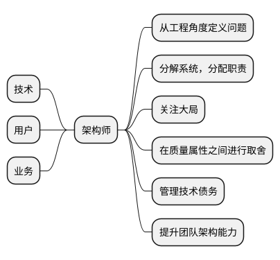
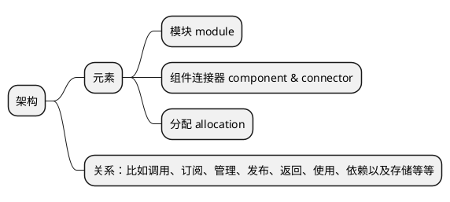
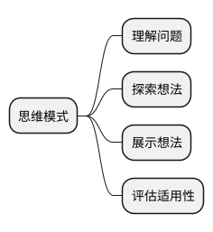
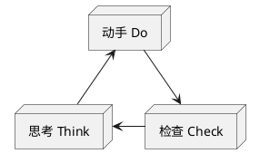
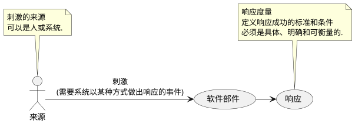

## 软件架构导论

**架构师**

**架构**

**项目回顾**
- 利益相关方是谁，主要业务目标是什么
- 项目的整体解决方案是什么样的
- 涉及到哪些技术
- 最大风险是什么，你是如何克服的
- 如果有机会重新做一遍，你会如何改进

### 设计思维 HART原则

#### 1. 以人为本 `human`
> 设计的本质是社交

利益相关方关系图

#### 2. 推迟决策 `ambiguity`
> 推迟不确定的决策

#### 3. 善于借鉴 `redesign`
> 所有设计都是在已有设计基础上重新设计和调整创新

#### 4. 化虚为实 `tangibility`
> 让想法具体化、有形化，以便于沟通交流

### 思维模式

### TDC循环

- 思考 `Think`：工程风险、业务目标、质量属性、权衡取舍
- 动手 `Do`：模型、原型、计划、备选方案
- 检查 `Check`：场景演练、方案比较、直接检验、理解核查

## 架构设计原理

### 架构设计时间的最佳平衡点

项目总工期 = 开发 + 架构设计 + 返工(弥补缺陷、重写代码、改正错误)

其中，随着架构设计时间的增加，返工量会逐步减少；存在一个最佳平衡点，使得项目总工期最小
- 千万行代码的大型软件系统，最佳平衡点取`37%`
- 一万行代码的小型软件系统，最佳平衡点取`5%`

### 关键架构需求 `Architecturally Significant Requirement`

##### 约束：给定或选定的不可更改的设计决策，分为`技术约束`和`业务约束`
##### 质量属性：外部可见特性，表征系统在特定环境下的运行情况

分为设计属性(可维护、可复用等)、运行属性(可用、性能、安全等)和感知属性(简单、指导等)

质量属性场景的六个元素：`刺激`、`来源`、`软件部件`、`响应`、`响应度量`和`环境背景`

##### 影响较大的功能需求：需要特别注意的特性和功能
##### 其他影响因素：时间、知识、经验、技术、办公司政治等影响决策的东西

### 架构选择

##### 决策矩阵 `decision matrix`

|       |                      选项A                       | 选项B |
| :---: | :----------------------------------------------: | :---: |
| 特性1 |           0（中等，即不提升也不降低）            |       |
| 特性2 |     -（降低，设计选项能给实现系统带来麻烦）      |       |
| 特性3 | --（严重降低，设计选项能给实现系统造成极大困难） |       |
| 特性4 |         +（设计选项能正常实现系统特性）          |       |
| 特性5 |         ++（设计选项能高效实现系统特性）         |       |

### 架构模式

针对特定问题的可复用解决方案。相比于设计模式，架构模式常涉及软件系统的多个组件，关注更宽泛的质量属性与抽象粒度

#### 分层模式 `Layers`

层间低耦合，层内高内聚，提升可维护性。依赖上只有上层允许使用下层

#### 端口适配器模式 `Port and Adapters`

使用输入源的可插拔适配器，以提供对事件和数据的访问，方便切换输入设备

#### 管道过滤器 `Pipe-and-Filter`

松耦合的过滤器通过各种方式进行组合和复用，从而创建出新管道

#### 面向服务架构模式 `Service-Oriented Architecture`

用独立的组件提供特定功能的服务，各种服务在运行时整合在一起，决定了系统的行为

#### 发布订阅模式 `Publish-Subscribe`

生产者和消费者通过消息总线间接通信

#### 共享数据模式 `Shared-Data`

多个组件通过共用的数据库访问数据

#### 多层模式 `Multi-Tier`

系统运行时的结构被组织成逻辑组，逻辑组分配到特定的物理组件。Tier是组件连接器结构或分配结构，处理运行时元素，layer是模块结构，处理设计时元素

### CSC迭代

#### 创建 `Create`

提出设计想法(画图或建模)，5-7min

#### 分享 `Share`

组内游说(pitch)，解释自己的设计如何满足目标，3-5min

#### 评判 `Critique`

评判设计与目标的关系，指出好的方面和可以改进的方面

### 优秀的软件架构师

- 与团队一起选择架构模式和技术
- 设计文档模板，与团队一起起草和评审文档
- 共同决策，及时评审，提供反馈
- 帮组团队组织工作，划分任务
- 接受变化，让架构易于调整
- 让大家就技术决策达成共识

#### 结对设计

#### 设计下放

- **告知**：由你做设计决策，然后告知团队结果
- **贯彻**：由你做设计决策，然后向团队说明设计理由
- **咨询**：在做设计决策前咨询团队的意见，最终仍由你决策
- **商定**：与团队就设计决策达成共识，平等话语权
- **建议**：通过观点、见解影响团队，但是由其他团队成员做设计决策
- **审查**：由团队做决策，并且由他们说明设计理由
- **委托**：委托另外一位成员做决策，由他负全责。你作为辅助，帮助团队收集信息

经验不足的团队，建议采用前三级权限

## 架构师工具

### 二选一 `Choose One Thing`

难以取舍时做决策(功能性需求应当进行公平评估)

### 移情图 `Empathy Map`

描绘利益相关方(比如客户，用户，维护人员)的任务，想法，感受，理解对方的目标

### GQM研讨会 `Goal-Question-Metric Workshop`

目标-问题-指标讨论，用于确定质量属性的响应度量

### 架构决策记录 `Architecture Decision Records`

架构决策记录(ADR)

### 决策矩阵 `Decision Matrix`
