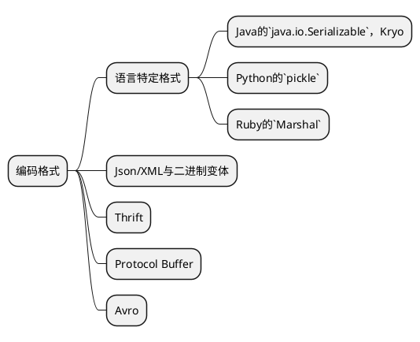
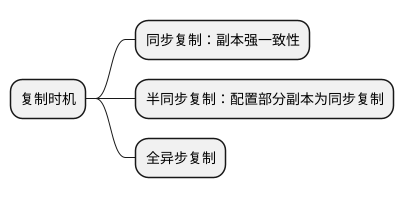
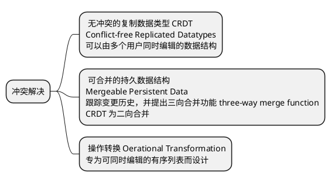
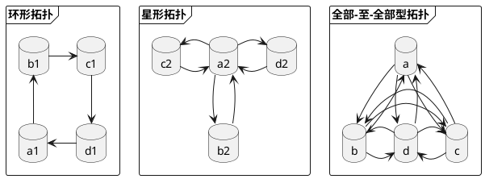
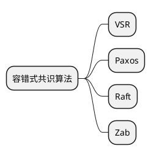
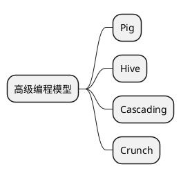
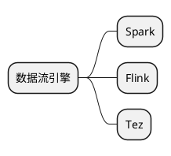
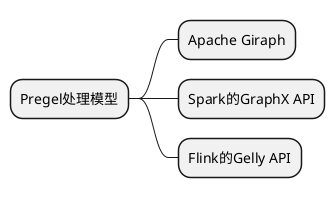
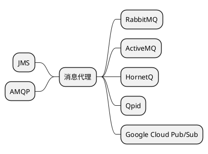

## 数据系统基础

### 1. 可靠、可扩展和可维护的应用系统

#### 可靠性 `Reliability`

发生硬软件故障、人为失误等意外情况，系统应可以继续正常运转：虽然性能可能有所降低，但确保功能正确

- 磁盘故障：对磁盘配合 **RAID** (独立硬盘冗余阵列)
- 人为失误：快速恢复如滚动更新，性能指标和错误率的监控

#### 可扩展性 `Scalability`

随着数据量、流量或复杂性等规模的增长，系统应以合理的方式来匹配这种增长

- 吞吐量：每秒处理的记录条数，一般批处理系统更关系该指标
- 响应时间：对于一段时间内的响应时间数据，取平均值和各取样点相对于平均值的百分比，再用中位数等指标来衡量

#### 可维护性 `Maintainability`

随着时间的推移，许多新的人员参与到系统开发和运维，以维护现有功能或适配新场景等，系统都应高效运转

- 可运维性：自动化运维
- 简单性：抽象设计
- 可演化性：敏捷开发


### 2. 数据模型与查询语言

#### 文档模型与关系模型

##### MapReduce查询

PostgresSQL

```sql
select date_trunc('month', observation_timestamp) as observation_month,
sum(num_animals) as total_animals
from observations
where family = 'Sharks'
group by observation_month;
```

MongoDB

```js
db.observations.mapReduce(
    function map() {
        var year = this.observationTimestamp.getFullYear()
        var month = this.observationTimestamp.getMonth() + 1;
        emit(year + ':' + month, this.numAnimals)
    },
    function reduce(key, values) {
        return Array.sum(values)
    },
    {
        query: {family: 'Sharks'},
        out: 'monthlySharkReport'
    }
)
```

```js
db.observations.aggregate([
    {$match: {family: 'Sharks'}},
    {$group: {
        _id: {
            year: {$year: '$observationTimestamp'},
            month: {$month: 'observationTimestamp'}
        },
        totalAnimals: {$sum: '$numAnimals'}
    }},
])
```

#### 属性图与Cypher查询

- 每个顶点包括：**唯一的标识符**、**出入边的集合**以及**键值对属性的集合**
- 每条边包括：**唯一的标识符**、**头部和尾部顶点**、**描述两个顶点间的关系类型的标签**以及**键值对属性的集合**

```sql
create table vertices (
    vertex_id integer primary key ,
    properties json
);

create table edges (
    edge_id integer primary key ,
    head_vertex integer references vertices(vertex_id),
    tail_vertex integer references vertices(vertex_id),
    label text,
    properties json   
);
```

**Cypher**

```
create
    (NAmerica:location {name: 'North America', type: 'continent'}),
    (USA:location {name: 'United States', type: 'country'}),
    (Idaho:location {name: 'Idaho', type: 'state'}),
    (Lucy:person {name: 'Lucy'}),
    
    (Idaho) -[:within]-> (USA) -[:within]-> (NAmerica)
    (Lucy) -[:born_in]-> (Idaho)
```

```
match
    (preson) -[:born_in]-> () -[:within*0..]-> (us:location {name: 'United States'}),
    (preson) -[:live_in]-> () -[:within*0..]-> (eu:location {name: 'Europe'})
return person.name
```

`:within*0..` 沿着一条within边，遍历零次或多次

#### 三元存储与SPARQL

##### 三元组 (主语，谓语，宾语)

- 主语为顶点 
- 宾语为值，则谓语为属性中的键值，此时表示顶点的属性键值对
- 宾语为顶点，则谓语为边

##### 资源描述框架 `RDF`

全网数据交换通用格式

##### SPARQL

采用RDF数据模型的三元存储查询语言

```
prefix : <uln:exmpale>

select ?presonName where {
    ?preson :name ?presonName.
    ?preson :bornIn / :within* / :name "United States".
    ?preson :liveIn / :within* / :name "Europe".
}
```

### 3. 数据存储与检索

##### 日志结构的最简单的数据库

追加式顺序写

```shell
#!/bin/bash

db_set() {
  echo "$1,$2" >> database
}

db_get() {
  grep "^$1," database | sed -e "s/^$1,//" | tail -n 1
}
```

#### SSTable 排序字符串表 `Sorted Strings Table`

储存有序不重复的键值对，只读文件，可以经过合并产生新的SSTable来减少总体的大小

##### LSM-Tree 日志结构合并树 `Log-Structured Merge Tree`

执行分级压缩

##### 星型模式 `维度建模`

模式中心是一个**事实表**。事实表的每一行表示在特定时间发生的事件。事实表中的列包含属性和外键，这里外键引用的表称作**维度表**

数据立方体：由不同维度分组的聚合网格

##### 列式存储

- 将每列中的所有值存储在一起
- 列压缩时，对于离散度低的列可以采用位图压缩

列存储格式：`Parquet`、Google的`Dremel`


### 4. 数据编码与演化



#### `Avro`

```
record Person {
    string username;
    union {null, long} favor = null;
    array<String> interests;
}
```

```json
{
  "type": "record",
  "name": "Person",
  "fields": [
    {"name": "username", "type": "string"},
    {"name": "favor", "type": ["null", "long"], "default": "null"},
    {"name": "interests", "type": {"type": "array", "items": "string"}}
  ]
}
```


## 分布式数据系统

### 5. 数据复制

#### 主从复制

主节点写入，从节点只读



##### 处理节点失效

- 新的从节点加入：在某个时间点对主节点的数据副本产生一个一致性快照，复制快照到新的从节点。从节点连接到主节点并请求快照点之后所发生的的数据更改日志
- 从节点失效：追赶式恢复
- 主节点失效：节点切换

##### 复制日志

- **基于语句的复制**：主节点记录每个写请求并将该操作语句作为日志发送给从节点。*不适用的场景*：非确定性函数、依赖执行顺序的语句以及有副作用的语句
- **预写日志WAL**：记录哪些磁盘块的哪些字节发送了变化。*主要缺点*：和储存引擎耦合
- **基于行的逻辑日志的复制**：行插入记录相关列的新值；行删除记录记录唯一标识或所有列的旧值；行更新记录唯一标识或所有列的旧值以及至少所有已更新列的新值。该技术也称为变更数据捕获
- **基于触发器的复制**：触发器支持注册自己的应用层代码，使得当数据库系统发生数据更改(写事务)时自动执行上述自定义代码，进而将数据更改记录到一个单独的表中

#### 复制滞后

##### 写后读

同一用户能读到之前自己写入的数据

- 用户访问可能修改的内容，则从主节点读取
- 跟踪最近最新更新时间，最近更新过的数据从主节点读取；并监控从节点的滞后程度，避免从滞后的从节点读取
- 客户端记录最新更新时间，并附带在读请求中。系统可以确保对该用户提供读服务时都应该至少包含了该时间戳的更新。如果不够新，则转发给另一个副本来处理，或等待直至副本接收到了最近的更新
- 副本跨数据中心，则转发给主节点所在的数据中心

##### 单调读

同一用户多次读取，只会读到更新的值而不会看到回滚的情况

- 同一用户总是从固定的同一副本执行读取

##### 前缀一致读

对于一系列按照某种顺序发生的写请求，在读取这些内容时也会按照当时写入的顺序

#### 多主节点复制

多个数据中心都配置一个主节点。可以提供写性能，容忍数据中心失效，但是需要处理写冲突

##### 避免冲突

特定用户路由到特定的数据中心，数据中心切流或用户漫游到另一数据中心时，此方法失效

##### 一致性收敛

确保所有的副本最终一致性

- 给每个写入分配唯一ID，挑选最高ID作为胜利者。如果基于时间戳，则称为最后写入者获胜 LWW **`Last Write Wins`**。这种方法容易丢失数据
- 给每个副本分配唯一ID，指定副本优先级写入，如序号高的副本写入优先。这种方法也容易丢失数据
- 以某种方法合并冲突值，如字符串拼接
- 利用预定义好的格式记录和保留冲突相关的所有信息，依靠应用层的逻辑，事后解决冲突



##### 多节点模型的拓扑结构



#### 无主节点复制

##### 节点失效后的写

- **`读修复`**：客户端并发读取多个副本，检测过期的返回值，然后将新值写入到过期的副本中。适用于被频繁读取的场景
- **`反熵`**：后台进程查找副本之间的差异，将任何缺少的数据从一个副本复制到另一个副本。此反熵过程会有明细同步滞后的问题

##### Quorum 法定票数读/写

n个副本，写入需要w个节点确认，读取需要查询r个节点，则 `w + r > n` 可读取到最新值

常见设置 `w = r = (n+1) / 2`

宽松的冲裁 **`sloppy quorum`**：集群节点数量N > n，写入和读取的节点可以不是同一批n个副本所在的节点

##### 版本矢量

所有副本的版本号集合称为版本矢量。当多个副本同时接受写入时，为每个副本和每个主键均定义一个版本号。每个副本在处理写入时增加自己的版本号，并跟踪从其他副本看到的版本号，进而指示要覆盖和要保留的并发值


### 6. 数据分区

##### 基于关键字区间分区

为每个分区分配一段连续的关键字或关键字区间范围
缺点是某些访问模式会导致热点问题，如基于时间戳的分区，这时可以以时间戳以外的其他内容作为关键字的第一项

##### 基于关键字哈希值分区

处理数据倾斜并使其均匀分布，比如 `MD5`、`Fowler-Noll-Vo`

对于**少数关键字的热点读写**的问题，一种可能的解决方案是：为关键字的头部或尾部附加随机串比如两位随机数，这样可以分散到100个不同分区，写入减轻了，但是读取需要从所有的100个分区读取并进行合并；此外需要额外的元数据来标记哪些关键字进行了上述处理

##### 基于文档分区的二级索引

在每个分区上维护当前分区数据的一个二级索引。这样读取的时候仍需要从所有的分区中读取并进行合并

##### 基于词条分区的二级索引

全局维护所有数据的一个二级索引，并将该索引进行分区。这样读取只需要读特定分区，但是写入会写入多个分区

##### 分区再平衡

- **固定数量分区**：创建远超实际节点数的分区数，为每个节点分配多个分区。添加新节点时，可以从每个现有节点匀走部分分区，直至再平衡
- **动态分区**：当分区数据增长超过一个可配的参数阈值时，拆分分区。数据缩减，则合并分区
- **按节点比例分区**：每个节点有固定分区数，即分区数与集群节点数成正比。数据集大小不变，则节点数增加时，分区会调整变得更小：`数据集大小 = 节点数 * 分区大小`。新节点加入，随机选择固定数量的现有分区进行分裂，并拿到这些分区的一半数量。此算法要求采用*基于哈希分区*


### 7. 事务

#### ACID的含义

事务所提供的安全保证即：原子性 Atomicity、一致性 Consistency、隔离性 Isolation、持久性 Durability

##### `原子性 Atomicity`

在出错时中止事务，并将部分完成的写入全部丢弃

##### ~~`一致性 Consistency`~~

对数据有特定的预期状态，任何数据更改必须满足这些状态约束或恒等条件。_本质要求应用层来维护状态一致，非数据库本身的属性_

##### `隔离性 Isolation`

并发执行的多个事务相互隔离，即可串行化

##### `持久性 Durability`

事务一旦提交成功，事务所写入的数据不会丢失。写入非易失性存储设备即可，比如磁盘或SSD

#### `读-提交 Read-Committed `

读时只能看到已成功提交的数据(防止**脏读**)；写时只能会覆盖已成功提交的数据(防止**脏写**)

##### `脏写`

- `行级锁`：一个事务在修改该行的时候，以独占锁的方法持有，直至事务结束才释放

##### `脏读`

- `读锁`：独占锁
- `多版本并发控制 MVCC`：对于每个待更新的对象，都会维护其旧值和所有事务设置的新值，在事务提交之前所有操作都读取旧值，仅当事务提交之后，才会切换到读取新值

#### `快照级别隔离与可重复读 Repeatable-Read`

读时只能看到事务开始之前提交的数据(防止**不可重复读/读倾斜**)

一般采用 `多版本并发控制 MVCC` 来实现快照级别隔离。当事务开始时，首先赋予一个唯一单调递增的事务ID，每当事务写入数据时，所写数据都会被标记写入者的事务ID

##### 更新丢失

并发的读-修改-写操作序列，出现了其中一个覆盖另一个的写入

- `原子写操作`: `update ... set v = v + 1 ...`
- `显示加锁`：`select ... for update`

#### `串行化 Serializable`

##### `写倾斜`：并发事务的写入改变了事务的写入，广义的更新丢失，可以发生在不同记录

##### `幻读`：一个事务的写入改变了另一个事务查询的结果

##### 实际串行执行

在一个线程上按顺序逐一执行。适用场景：事务简短高效，活动数据集可以完全加载到内存，写入吞吐量足够低，且几乎无跨分区事务

##### 两阶段加锁 `2PL`

被其他正在运行的事务读取过的对象，写入时需要等待该事务结束；被其他正在运行的事务修改过的对象，读取时同样需要等待该事务结束

读写锁的2PL实现：
- 读取对象，先获取共享锁，若已被其他事务获取了独占锁，则必须等待
- 修改对象，先获取独占锁，若已被其他事务获取了共享或独占锁，则必须等待
- 若首先读取对象，然后尝试写入对象，则需要将共享锁升级为独占锁，此时等同于需要竞争独占锁
- 事务获取锁之后，一直持有直至事务结束

出现的死锁需要自动检测，并强行中止其中的一个以大破僵局

###### 谓词锁与索引区间锁 `next-key locking`

谓词锁：读取时，使用共享锁锁定满足where条件的所有行数据。

索引区间锁：扩大锁定范围，锁定一个区间或者整张表

##### 可串行化的快照隔离 `Serializable Snapshot Isolation, SSI` 

乐观并发算法，如果可能发生潜在冲突，事务也继续执行，直至事务提交之前，进行冲突检查

- 检测是否读取了过期的MVCC对象
- 检查写入是否影响了之前的读


### 8. 分布式系统的挑战

##### 不可靠的网络

超时检测

- 网络阻塞与排队：TCP流量控制、网络交换机阻塞或丢包，CPU满载，虚拟机管理器切换

##### 不可靠的时钟

**墙上时钟**

比如Linux的 `clock_gettime(CLOCK_REALTIME)` 或Java的 `System.currentTimeMillis()`。返回当前时间，可以与NTP进行网络同步。高精度(比如100us)可以采用GPS接收机和PTP(精确时间协议)

- 计算机中的石英钟可能发生时钟漂移(运行速度加快或减慢)，漂移主要取决于机器温度。谷歌假设其服务器漂移为200ppm(ppm为百万分之一)，即30s的误差为6ms
- 与NTP时间差别过大时，可能会拒绝同步或被强制重置
- 与NTP服务器连接失败或延迟(可能至少产生35ms的偏差)
- NTP服务器故障
- 闰秒会产生一分钟59秒或61秒的现象
- 虚拟机数十毫秒的暂停切换导致的时钟跳跃
- 在未完全可控的设备如移动或嵌入式设备，用户设置的硬件时间

**单调时钟**

比如Linux的 `clock_gettime(CLOCK_MONOTONIC)` 或Java的 `System.nanoTime()`。保证返回的时间总是向前而不会往后拨，更适合测量持续时间段

**时钟的置信区间**

Google Spanner 的`TrueTime API` 会明确报告本地时钟的置信区间，即[不早于，不晚于]，该范围主要取决于本地时钟与高精度时钟源同步后经历的时间间隔。可以在每个数据中心部署一个GPS接收器或原子钟，保证所有时钟同步在约7ms之内完成。

Spanner确定事件因果关系的方法：观察两个事件A和B，如果A的置信区间与B没有重叠且早于B，则可以断定B一定发送在A之后；如果重叠了，则等待置信区间的长度


### 9. 一致性与共识

#### 可线性化

> 现已证明：如果想要满足线性化，那么读写请求的响应时间至少要与网络中延迟成正比

可线性化是读写寄存器(单个对象)的最新值的保证，也称为**原子一致性**，**强一致性**。不要求将操作组合到事务中，因此无法避免写倾斜等问题。同时支持可串行化时，称为严格的可串行化，或强的单副本可串行化，实际串行化和2PL都是可线性化

**需要可线性化的场景**：
- 加锁与主节点选举
- 约束与唯一性保证：唯一性本质上和加锁类似
- 跨通道的时间依赖：比如可线性化的文件存储服务

**复制方案下的线性化**
- 主从复制：从主节点或同步更新的从节点读，则可以满足线性化；快照隔离和脑裂的主节点不满足
- 共识算法；可线性化，实现系统比如`Zookeeper`, `etcd`
- 多主复制：不可线性化
- 无主复制：可能不可线性化，在网络延迟下会发生读旧值情况。使用同步执行读修复可以满足线性化读和写操作，但是不支持线性化`比较和设置`操作

**CAP理论**

不要求线性化的应用更能容忍网络故障

- 要求线性化，但是由于网络问题，某些副本与其他副本断开连接后无法继续处理请求，必须等待网络修复或直接返回错误，导致服务不可用
- 不要求线性化，出现网络问题时，每个副本可以独立处理请求，此时服务可用，但是不符合线性化

CAP也可以描述为：在网络分区情况下，选择一致性还是可用

#### 因果一致性

因果关系定义系统中的因果顺序，即某件事应该发生在另一件事之前。因果一致性可以认为是，不会由于网络延迟而显著影响性能，又能对网络故障容错的最强的一致性模型。

**全序和偏序**
- 可线性化：存在全序关系(支持任何两个元素之间的比较)。系统行为就好像只有一个副本，且每个操作都是原子的
- 因果关系：至少是偏序关系。如果两个事件都没有发生在对方之前，那么就是并发关系。如果两个事件是因果关系(一个发生在另一个之前)，则可排序。可线性化强于因果关系

**兰伯特时间戳 `Lamport timestamp`**
可以产生与因果关系一致的序列号。用于确保全序关系

首先每个节点有一个唯一ID和一个计数器记录各自已处理的请求总数。Lamport时间戳为键值对 `计数器值，节点ID` 。节点和客户端追踪最大的计数器值，并在请求上附带该值，如果收到的请求中的计数器值大于自身的计数器值，则把自身的计数器值修改为该最大值

#### 全序关系广播(原子广播)

- **可靠发送**：没有消息丢失。如果消息发送到了某一个节点，则它一定要发送到所有节点
- **严格有序**：消息总是以相同的顺序发送给每个节点

全序关系广播算法必须保证上述两条，当网络中断时，要继续重试，直至网路修复，消息发送成功

**状态机复制**：每个副本都按相同的顺序处理写请求，那么所有副本都可以保持一致

全序关系广播可用于实现可串行化事务，采用*实际串行执行*。

**采用全序关系广播实现线性化存储**
- 线性化的原子比较-设置操作：用户名唯一性约束，在日志追加一条消息，指明要插入的用户名；读取日志，将其广播给所有节点，并等待回复；检查是否有任何消息声明该用户名已被使用，有其他节点响应则中止操作
- 线性化读取
  - 广播读请求，进行quonum读
  - 获取消息在当前最新日志中消息的位置，查询位置等待直至该位置之前的条目都已接收，然后再读取，类似于zookeeper的sync
  - 从同步更新的副本读取

**采用线性化存储实现全序关系广播**

对于每个通过全序关系广播的消息，原子递增并读取该线性化的计数，作为序列号附加在消息上，而接收者也严格按照序列号来发送回复消息

#### 原子提交与两阶段提交

**原子提交**：所有节点必须对跨节点或跨分区事务的结果达成一致，要么全部成功提交，要么中止或回滚

**两阶段提交 `Two-Phase Commit` (阻塞式原子提交协议)**

- 准备阶段：协调者(事务管理器)发送一个准备请求给所有节点，询问是否可以提交，参与者回复是/否
- 确认阶段：根据参与者的回复，协调者发送确认提交/确认回滚的请求给所有节点

事务开始时，协调者提供一个全局事务ID，日志持久记录，并返回给应用程序；协调者发送准备请求时，有任一请求失败，即通知所有节点放弃事务；参与者回复协调者之前，持久化变更，记录回复答案；协调者发送确认请求之前，持久化最终决定；协调者需一直重试确认请求，直至所有节点都成功响应为止

#### 共识

- 协商一致性：所有节点都接受相同的决议
- 诚实性：所有节点不能反悔，即对一项提议不能有两次决定
- 合法性：如果决定了值v，则v一定是由某个节点所提议的
- 可终止性：节点如果不崩溃，则最终一定可以达成决议(强调**容错**，属于活性问题，其他三种属于安全性问题)



全序关系广播相当于多轮共识
- 协商一致性：所有节点以相同顺序发送相同消息
- 诚实性：消息不能重复
- 合法性：消息不会损坏，也不会凭空捏造
- 可终止性：消息不会丢失


## 派生数据

### 10. 批处理系统

**数据系统**
- **在线系统**：等待用户请求或指令的到达，当收到请求或指令后，服务试图尽可能快地处理它，并发回响应
  响应时间通常是服务性能的主要衡量指标，而可用性同样非常重要
- **批处理系统(离线系统)**：接收大量的输入数据，运行一个作业来处理数据，并产生输出数据。批处理作业的主要性能衡量指标是吞吐量
- **流处理系统(近实时系统)**：处理输入并产生输出，但是是在事件发生后不久即对事件进行处理

#### 使用Unix工具进行批处理

访问次数最多的五个URL
```shell
# sort -r -n 按照数字反向排序
cat /var/log/nginx/access.log |
  awk '{print $7}' |
  sort             |
  uniq -c          |
  sort -r -n       |
  head -n 5
```

```ruby
counts = Hash.new(0)
File.opne('/var/log/nginx/access.log') do |file|
    file.each do |line|
        url = line.split[6]
        counts[url] += 1
    end
end
top5 = counts.map{|url, count| [count, url]}.sort.reverse[0..5]
top5.each{|count, url| puts "#{count} #{url}"}
```

#### MapReduce的Join与分组

**排序-合并join**

一种**reduce端join**，通过关键字对mapper的输出进行分区，然后对键值对进行排序，最后reducer将两侧排好序的记录列表合并在一起

**广播哈希join**

一种**map端join**，将小数据集全部加载到内存或保存至磁盘的只读索引(可以驻留在操作系统的页面缓存上)，每个分区的mapper都对于每条大数据集中的数据，都去小数据集中查找并合并

**分区哈希join**

一种**map端join**，两个join的输入具有相同数量的分区，则可以根据相同的关键字和哈希函数，将记录分配到相同分区，并在各自分区上进行合并

#### 超越MapReduce

MapReduce将**中间状态实体化**，即写入到HDFS,可以容错，但是会造成延迟放大(必须等到中间状态全部输出之后下一个子任务才开始运行)，数据冗余和IO过多





#### 图与迭代处理

**Pregel处理模型**



计算的批量同步并发模型，源自Google的Pregel论文


### 11. 流处理系统

#### 消息系统

消息代理(消息队列)，本质是一种针对处理消息流而优化的数据库


**消息传递模式**
- 负载均衡式：每条消息传递给一个消费者，即共享订阅
- 扇出式：每条消息传递给所有的消费者，即主题订阅/交换绑定

**基于日志的消息存储**
> Apache Kafka

对日志进行分区，然后将主题定义为多组分区，为每个消息分配一个单调递增的偏移量

#### 数据库与流

**变更数据捕获 Change Data Capture, CDC**

读取数据库日志变更记录，比如MongoDB的oplog、MySQL的binlog

**事件溯源**

将所有对应用程序状态的更改保存为更改事件的日志，类似于**编年史数据模型**

#### 流处理

**复杂时间处理 CEP**
> Esper, Apama, SQLstream, TIBCO StreamBase

指定规则，在流中搜索特定模式的事件

**流分析**
> Storm, Spark Streaming, Flink, Concord, Samza, Kafka Streams, Google Cloud Dataflow, Azure Stream Analytics

**维护物化视图**

#### 流式join

**流流join(窗口join)**

维护窗口期的状态，对于每个事件，检查另一事件源的数据是否已到达

**流表join**

对于每个事件，在数据库中查找需要join的数据

**表表join(物化视图维护)**

缓存join，每当底层表发生变更时进行更新

