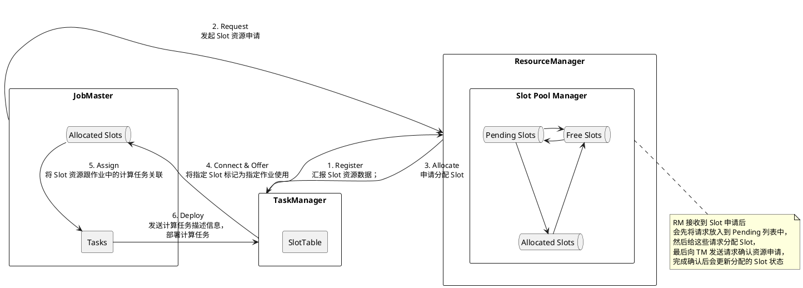
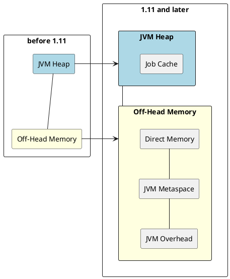
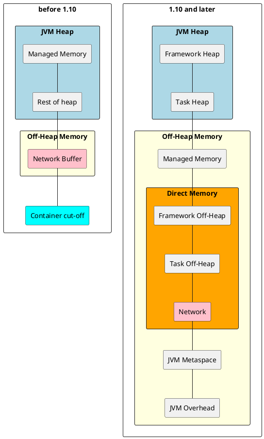

## 流量控制

### 基于Credit的反压机制

下游的InputChannel从上游的ResultPartition接收数据的时候，会基于当前已经缓存的数据量，以及可申请到的LocalBufferPool与NetworkBufferPool，计算出一个Credit值返回给上游。上游基于Credit的值，来决定发送多少数据。Credit就像信用卡额度一样，不能超支

当下游发生数据拥塞时，Credit减少值为0，于是上游停止数据发送。拥塞压力不断向上游传导，形成反压

## 系统容错

流计算容错一致性保证有三种，分别是：
- Exactly-once，是指每条 event 会且只会对 state 产生一次影响，这里的“一次”并非端到端的严格一次，而是指在 Flink 内部只处理一次，不包括 source和 sink 的处理
- At-least-once，是指每条 event 会对 state 产生最少一次影响，也就是存在重复处理的可能
- At-most-once，是指每条 event 会对 state 产生最多一次影响，就是状态可能会在出错时丢失

### Checkpointing检查点

Flink会在流上定期产生一个barrier（屏障）。barrier 是一个轻量的，用于标记stream顺序的数据结构。barrier被插入到数据流中，作为数据流的一部分和数据一起向下流动，过程如下：
1. barrier 由source节点发出
2. barrier会将流上event切分到不同的checkpoint中
3. 汇聚到当前节点的多流的barrier要对齐（At least once不需要对齐）
4. barrier对齐之后会进行Checkpointing，生成snapshot，快照保存到StateBackend中
5. 完成snapshot之后向下游发出barrier，继续直到Sink节点

## 资源管理

整个 Flink 集群分为四个角色节点：

- **Dispatcher** 接收各类查询请求，例如作业的各类 Metrics 等；
- **JobMaster** 管理作业的执行状态；
- **ResourceManager** 管理 Flink 集群的资源和资源分配；
- **TaskManager** 管理 Flink 计算任务的执行。

### Slot请求流程

### ResourceManager

ResourceManager 接收到 Slot 申请后会先将请求放入到 Pending 列表中，然后给这些请求分配 Slot，最后向 TaskManager 发送请求确认资源申请，完成确认后会更新分配的 Slot 状态。

#### JobMaster

**waitingForResourceManager**

JobMaster根据每个计算任务，生成一个Slot申请请求 (生成唯一的AllocationID)，并放入此请求列表。

多个计算任务可能会共享同一个 Slot。

当 JobMaster 跟 ResourceManager 建立连接时，从 waitingForResourceManager 中获取Slot申请请求并发送，同时将每个 Slot Request 放入到 Pending Request 列表中。

**PendingRequests**

当 JobMaster 接收到 TaskManager 的 offerSlots 请求时，根据 AllocationID 从 pendingRequests 中移除指定的 Request，然后通过异步回调，将 Slot 分配给指定的计算任务，并在 AllocatedSlots 数据结构中增加分配的 Slot 信息。

**AllocatedSlots**

已经被分配给计算任务的Slot信息列表。

**AvailableSlots**

还未被分配给计算任务的Slot信息列表。

根据AllocationID在pendingRequests中找不到对应请求，或LazyFromSource过程中上游计算任务执行完成需要释放Slot，会将这些未被分配的Slot放入到AvailableSlots中。

分配Slot给指定的计算任务时，优先使用AvailableSlots中的Slot，只有未找到才会向ResourceManager发起请求。AvailableSlots中的Slot的时间戳会定时检查，和当前时间超过一定阈值，则主动释放，避免资源泄漏。

### TaskManager

**TaskSlotTable**

管理 Slot ，以及Slot和计算任务之间的关系

- taskSlots，根据 Slot 索引号管理该 Slot 的状态(TaskSlot)，TaskSlot 里包含该 Slot 的计算任务列表等数据；
- allocatedSlots，根据 AllocationID 管理该 Slot 的状态(TaskSlot)；
- taskSlotMappings，根据计算任务的 ID(ExecutionAttemptID) 管理计算任务和 TaskSlot；
- slotsPerJob，根据 JobID 管理属于该 Job 的 AllocationID 集合。

**JobTable**

管理和 JobMaster 的连接信息

当 TaskManager 获取到指定作业的 Slot 申请时，根据 JobMaster 的地址跟 JobMaster 创建连接，向 JobMaster 注册，并将连接信息保存到 JobTable 中

**TaskSlot**

TaskSlot的状态：

- ACTIVE：正在被指定的作业使用；

- ALLOCATED：创建时的初始状态，为某个作业创建，但是还没被使用；

- RELEASING：正在被释放中。

在 TaskSlot 创建时，会初始化一个 MemoryManager，管理 Slot 中所有计算任务申请和释放 Managed Memory，共用 TaskSlot 的所有计算任务共享 MemoryManager，TaskSlot 管理了所有在上面运行的 Task 列表

### 资源管理策略

**细粒度资源管理**([FLIP-56: Dynamic Slot Allocation](https://cwiki.apache.org/confluence/display/FLINK/FLIP-56%3A+Dynamic+Slot+Allocation))

> 原先1.13以前的版本，TaskManager 会将 ManagedMemory 会按照里面的 Slot 进行等分，造成资源浪费

JobMaster 向 ResourceManager 申请 Slot 时，会向 ResourceManager 指定资源数量，包括 CPU、内存等。

**声明式资源申请**([FLIP-138: Declarative Resource management](https://cwiki.apache.org/confluence/display/FLINK/FLIP-138%3A+Declarative+Resource+management))。

JobMaster 向 ResourceManager 申请资源时，会将所需的多个 Slot 打包成一个 Batch，向 ResourceManager 发起资源申请。

## 内存模型

### JobManager

**Total Process Memory**

JVM 使用的总内存， Total Process Memory = Total Flink Memory + JVM Metaspace + JVM Overhead。可由`jobmanager.memory.process.size` 配置

**Total Flink Memory**

主要是框架和用户作业代码需要的内存 `jobmanager.memory.flink.size`

**JVM Heap**

JVM 启动时设置 heap 大小 `jobmanager.memory.heap.size`

其中 Job Cache 由`jobstore.cache-size` 配置，缓存 Job ExecutionGraph 信息

**Off-heap Memory**
`-XX:MaxDirectMemorySize` 限制的内存，主要是应用程序调用 native 方法使用的，包括 JM 网络通信的部分（akka）。可由 `jobmanager.memory.off-heap.size=128m` 配置

**JVM Metaspace**

`-XX:MaxMetaspaceSize` 限制的内存，主要用于 class load 相关。可由 `jobmanager.memory.jvm-metaspace.size=256m` 配置

**JVM Overhead**

保留给JVM其他的内存开销，例如：Thread Stack、code cache、GC 回收空间等等。可由 `jobmanager.memory.jvm-overhead.min=192m`、  `jobmanager.memory.jvm-overhead.max=1g`、  `jobmanager.memory.jvm-overhead.fraction=0.1`配置

### TaskManager

**Total process Memory**

TM 总的内存大小配置，Total Flink Memory = Total Flink Memory + JVM Metaspace + JVM Overhead。可由 `taskmanager.memory.process.size` 配置

**Total Flink Memory**

Task Executor 消耗的所有内存。可由 `taskmanager.memory.flink.size` 配置

**Framework Heap Memory**

为Task Executor本身所配置的堆内存大小。可由`taskmanager.memory.framework.heap.size=128m` 配置

**Task Heap Memory**

专门用于执行Flink任务的堆内存空间。可由`taskmanager.memory.task.heap.size` 配置

**Managed memory**

由 Task Executor 直接管理的 off-heap 内存，它主要用于排序、哈希表、中间结果缓存、RocksDB 的 backend。可由`taskmanager.memory.managed.size` 配置，默认为 `taskmanager.memory.managed.fraction=0.25` * TotalFlinkMem

**Framework Off-heap Memory**

Task Executor 保留的 off-heap memory，不会分配给任何 slot。可由`taskmanager.memory.framework.off-heap.size=128m` 配置

**Task Off-heap Memory**

Task Executor 执行的 Task 所使用的堆外内存。如果调用了 Native 的方法，则需要用到 off-heap 内存。可由`taskmanager.memory.task.off-heap.size=0` 配置

**Network Memory**

用于网络传输的 Network Buffer。由`taskmanager.memory.network.min=64m`、
`taskmanager.memory.network.max=2g`、`taskmanager.memory.network.fraction=0.3` * TotalFlinkMem 配置

**JVM metaspace**

由`taskmanager.memory.jvm-metaspace.size=256m` 配置

**JVM Overhead**

由`taskmanager.memory.jvm-overhead.min=192m`、
`taskmanager.memory.jvm-overhead.max=1g`、`taskmanager.memory.jvm-overhead.fraction=0.1` * TotalProcesskMem 配置
