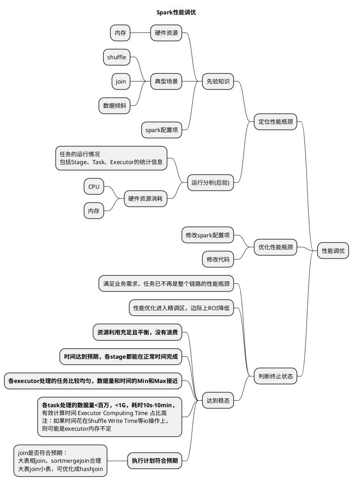

## 概论



## 定位性能瓶颈

### 先验知识

#### 硬件资源

**CPU**

- CPU利用率低：core多，内存少，导致多余的core挂起；数据分区过多，调度时间占比过高
- 并行度 `spark.sql.shuffle.partitions`：同时可以处理的任务数
- core估算：任务数为总核数的2-3倍

**内存**

- Driver OOM
- Executor OOM：增加内存，提升并行度
- 内存估算：Execution Memory大概一核2-3G\n\
Storage Memory可在spark ui上看

#### 典型场景

##### shuffle

- 调大 `spark.shuffle.file.buffer`，减少溢出到磁盘的数据的量
- 尽量做小维表(对列进行裁剪、编码)，最好能广播出去

##### join

**实现方式**

- **hash join**
构建hash表 O(N)，查找 O(1)

- **sort merge join**
归并排序，排序 O(logM+logN)，查找 O(M+N)

- **nested loop join**
不等值关联，双重循环，查找 O(MN)

**join策略**

- __**broadcast hash**__
小表构建hash表，以广播方式分发小表的数据

- __**shuffle sort merge**__

- __**shuffle hash**__

- __**broadcast nested loop**__
执行效率低下，先小表广播，再NLJ关联

- __**shuffle cartesian product**__
执行效率低下，先shuffle，再NLJ关联

**join最佳实践**

- 多表join时，让小表先join
- inner join时，加参数自动优化join顺序
```sql
spark.sql.cbo.enabled = true;
spark.sql.cbo.joinReorder.enabled = true;
```
- 小于1T的小表join，可以尝试优化sort merge join为shuffle hash join

##### 数据倾斜

- 单值重复或null，可以尝试过滤或修正数据
- 提高shuffle并行度
- join或group更多的key，打散数据
- 广播变量，避免大表shuffle
- 两阶段shuffle+加盐，spark3.0可开启AQE

##### spark配置项

- `spark.executor.cores`
- `spark.dynamicAllocation.maxExecutors=500`
- `spark.sql.shuffle.partitions`
shuffle任务数，调大之后，也需要将executor也调大，一般取任务数的1/4 - 1/2，例如：20g * 5cu，300个任务
- `spark.sql.adaptive.maxNumPostShufflePartitions=5000`
aqe自适应参数，reduce分区个数最大值

##### 其他

- 避免用UDF，或者用scala和java UDF
- 避免直接用RDD，而是使用DataFrame、Dataset或SQL
- 输出小文件处理
- 不要滥用cache，否则影响执行内存

### 后验分析(运行分析)

#### 任务的运行情况

Stage、Task、Executor等的统计信息

#### 硬件资源消耗

- CPU
- 内存

## 优化性能瓶颈

- 修改spark配置项
- 修改代码

## 判断终止状态

- 满足业务需求，任务已不再是整个链路的性能瓶颈
- 性能优化进入精调区，边际上ROI降低
- 达到稳态
  - **资源利用充足且平衡，没有浪费**
  - **时间达到预期，各stage都能在正常时间完成**
  - **各executor处理的任务比较均匀，数据量和时间的Min和Max接近**
  - **各task处理的数据量<百万，<1G，耗时10s-10min，有效计算时间 Executor Computing Time 占比高。注：如果时间花在Shuffle Write Time等io操作上，则可能是executor内存不足**
- 执行计划符合预期
  - join是否符合预期：大表相join，sortmergejoin合理，大表join小表，可优化成hashjoin
