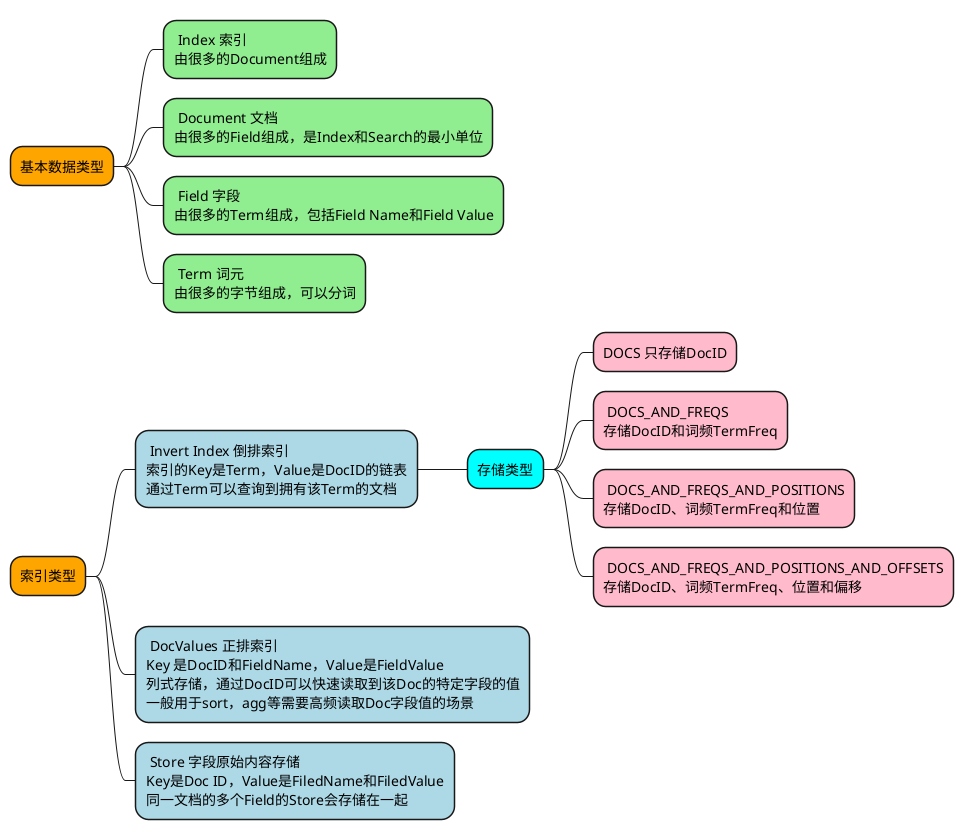

## 概述

Elasticsearch是一个建立在全文搜索引擎库Apache Lucene 基础上的实时的分布式搜索和分析引擎，它可以帮助我们用很快的速度去处理大规模数据，可以用于全文检索、结构化检索、推荐、分析以及统计聚合等多种场景。

## 数据模型

### Lucene

Lucene提供了最基本的索引和查询的功能，是一个单机的搜索库，并且没有主键概念和更新逻辑

### Lucene/Elasticsearch数据模型

### Elasticsearch对Lucene的扩展

Elasticsearch通过增加_id、_version、_source、_routing和_seq_no等多个系统字段，实现了分布式搜索和部分字段更新等Lucene缺失的功能

| System Field  |  含义  | Lucene Index | Lucene DocValues | Lucene Store |
| :-----------: | :----: | :----------: | :--------------: | :----------: |
|     _uid      |  主键  |    **Y**     |                  |    **Y**     |
|   _version    |  版本  |              |      **Y**       |              |
|    _source    | 原始值 |              |                  |    **Y**     |
|    _seq_no    |  序号  |    **Y**     |      **Y**       |              |
| _primary_term | 主编号 |              |      **Y**       |              |
|   _routing    |  路由  |    **Y**     |                  |    **Y**     |
| _field_names  | 字段名 |    **Y**     |                  |              |

#### 1 _id

_id是一个用户级别的虚拟字段，Lucene不会存储该字段的值。表示Doc的主键，在写入的时候，可以指定该Doc的ID值，如果不指定，则系统自动生成一个唯一的UUID值。

Lucene中没有主键索引，要保证系统中同一个Doc不会重复，Elasticsearch引入了_id字段来实现主键。每次写入的时候都会先查询id，如果有，则说明已经有相同Doc存在了。

#### 2 _uid

> Index#Doc, Store

_uid的格式是：type + '#' + id。同Index下值是唯一的

#### 3 _version

> DcoValues

每个Doc都会有一个Version，该Version可以由用户指定，也可以由系统自动生成。如果是系统自动生成，那么每次Version都是递增1。

Elasticsearch通过使用version来保证对文档的变更能以正确的顺序执行，避免乱序造成的数据丢失：

- 首次写入Doc的时候，会为Doc分配一个初始的Version：V0，该值根据VersionType不同而不同。
- 再次写入Doc的时候，如果Request中没有指定Version，则会先加锁，然后去读取该Doc的最大版本V1，然后将V1+1后的新版本写入Lucene中。
- 再次写入Doc的时候，如果Request中指定了Version：V1，则继续会先加锁，然后去读该Doc的最大版本V2，判断V1==V2，如果不相等，则发生版本冲突。否则版本吻合，继续写入Lucene。
- 当做部分更新的时候，会先通过GetRequest读取当前id的完整Doc和V1，接着和当前Request中的Doc合并为一个完整Doc。然后执行一些逻辑后，加锁，再次读取该Doc的最大版本号V2，判断V1==V2，如果不相等，则在刚才执行其他逻辑时被其他线程更改了当前文档，需要报错后重试。如果相等，则期间没有其他线程修改当前文档，继续写入Lucene中。这个过程就是一个典型的read-then-update事务。

#### 4 _source

> Store

存储原始文档，也可以通过过滤设置只存储特定Field

_source字段的主要目的是通过doc_id读取该文档的原始内容，所以只需要存储Store即可

Elasticsearch中使用_source字段可以实现以下功能：

- Update：部分更新时，需要从读取文档保存在_source字段中的原文，然后和请求中的部分字段合并为一个完整文档。如果没有_source，则不能完成部分字段的Update操作。
- Rebuild：最新的版本中新增了rebuild接口，可以通过Rebuild API完成索引重建，过程中不需要从其他系统导入全量数据，而是从当前文档的_source中读取。如果没有_source，则不能使用Rebuild API。
- Script：不管是Index还是Search的Script，都可能用到存储在Store中的原始内容，如果禁用了_source，则这部分功能不再可用。
  Summary：摘要信息也是来源于_source字段。

#### 5 _seq_no

> Index#DOCS_AND_FREQS_AND_POSITIONS, Analyzer, DocValues

严格递增的顺序号，每个文档一个，Shard级别严格递增，保证后写入的Doc的_seq_no大于先写入的Doc的_seq_no。任何类型的写操作，包括index、create、update和Delete，都会生成一个_seq_no。

每个文档在使用Lucene的document操作接口之前，会获取到一个_seq_no，这个_seq_no会以系统保留Field的名义存储到Lucene中，文档写入Lucene成功后，会标记该seq_no为完成状态，这时候会使用当前seq_no更新local_checkpoint。

checkpoint分为local_checkpoint和global_checkpoint，主要是用于保证有序性，以及减少Shard恢复时数据拷贝的数据拷贝量。

Elasticsearch中_seq_no的作用有两个，一是通过doc_id查询到该文档的seq_no，二是通过seq_no范围查找相关文档，所以也就需要存储为Index和DocValues（或者Store）。由于是在冲突检测时才需要读取文档的_seq_no，而且此时只需要读取_seq_no，不需要其他字段，这时候存储为列式存储的DocValues比Store在性能上更好一些。

#### 6 _primary_term

> DocValues

每当Primary Shard发生重新分配时，比如重启，Primary选举等，_primary_term会递增1。_primary_term主要是用来恢复数据时处理当多个文档的_seq_no一样时的冲突，避免Primary Shard上的写入被覆盖。

Elasticsearch中_primary_term只需要通过doc_id读取到即可，所以只需要保存为DocValues就可以了.

#### 7 _routing

> Index#Doc, Store

在mapping中，或者Request中可以指定按某个字段路由。默认是按照_Id值路由。

Elasticsearch中文档级别的_routing主要有两个目的，一是可以查询到使用某种_routing的文档有哪些，当发生_routing变化时，可以对历史_routing的文档重新读取再Index，这个需要倒排Index。另一个是查询到文档后，在Response里面展示该文档使用的_routing规则，这里需要存储为Store。

#### 8 _field_names

> Index#Doc

该字段会索引某个Field的名称，用来判断某个Doc中是否存在某个Field，用于exists或者missing请求。

Elasticsearch中_field_names的目的是查询哪些Doc的这个Field是否存在，所以只需要倒排Index即可。
