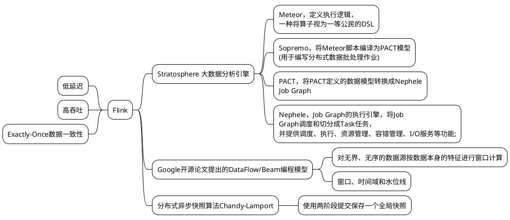
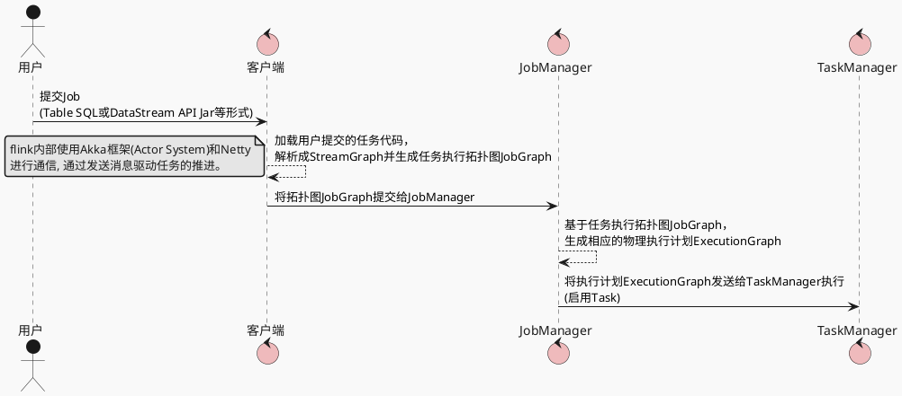
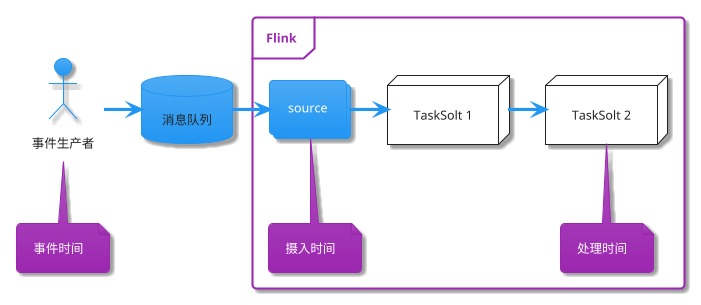
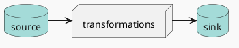
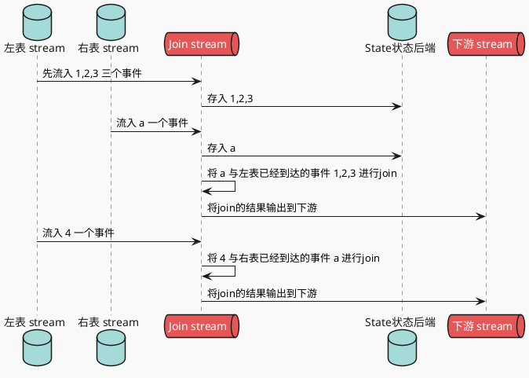
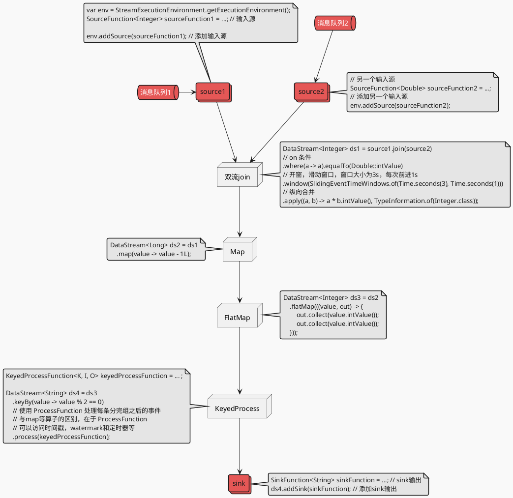
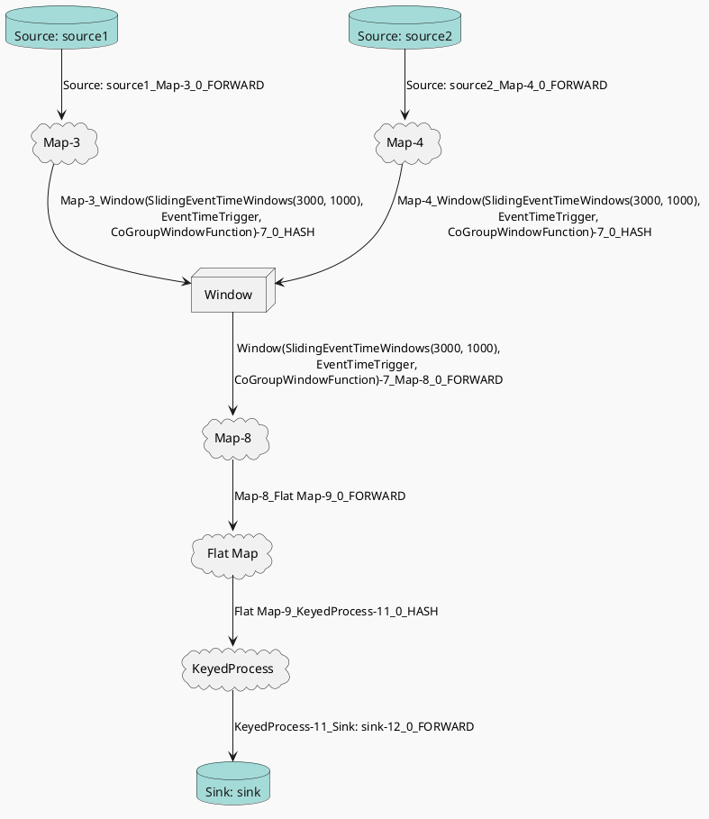

## 概述

Apache Flink是一个开源的分布式，高性能，高可用，准确的流处理框架。同时支持实时流(stream)处理和批(batch)处理，其中批数据看做是流数据的一个特例。

在批(batch)处理中，批数据是在时间上**有界的数据**，需要处理的数据量是确定的。而在流(stream)处理中，流数据是在时间上**无界的数据**。相对于批数据，流数据增加了一个新的时间维度。流处理和批处理，需要处理的对象都是**大数据**，需要解决大数据处理的共性问题。

### 流处理和批处理

CAP定理是大数据处理的基础约束，对一个分布式计算系统，C(Consistency 一致性)、A(Availability 可用性)、P(Partition tolerance 分区容忍性)难以同时满足。

因为大数据处理是在分布式环境下执行的，所以P是默认要满足的，C和A之间需要做出权衡取舍。

对于批处理系统，追求的是C，保证结果的正确性，牺牲了A，因为批处理对延时不敏感，几分钟甚至几小时之内获得计算结果都可以。

对于流处理系统，首先要保证C，用户对数据处理的基本需求，是要获得正确的结果。但是A也不能牺牲，因为流式数据处理天然有实时性的需求，较高的数据延时会严重影响用户体验。受CAP定理的约束，C和A难以兼得，于是在流式处理系统中，问题被定义成：在保证准确性的前提下，尽可能地追求实时性。

### Flink设计思想



## Flink解决方案

### 集群架构


##### JobManager（master）

Flink 系统的管理节点，全局只有一个，管理所有的 TaskManager，并决策用户任务在哪些 Taskmanager 执行。同时在运行过程中，会负责所有需要中央协调的操作，比如说检查点（checkpoints）的协调。

##### TaskManager (slave)

Flink 系统的业务执行节点，执行具体的用户任务，提供了内存管理、IO管理、网络管理功能。每个TaskManger上运行一个jvm进程。每个TaskManger拥有多个TaskSlot，而每个TaskSlot运行一个线程。Flink允许同一个任务的多个子任务，并且会尽量将多个子任务放到一个slot中执行。

### 时间

流数据相对于批数据，增加了一个时间维度。时间可以有以下3中表征方式:
- `Event Time` 表征事件发生的时间，是事件本身的固有属性，由事件生产者自行定义，默认为空，即`Long.MIN_VALUE`。可以用于解决消息乱序的时候一致性问题
- `Ingestion Time` 事件流入Flink source operator的时间。
- `Processing Time` 事件被Flink算子处理的时间。



### 窗口 Window

由于流数据是时间上是无限的，那么可以将数据流在逻辑上做切分，分成一个个的窗口，在每一个窗口中进行数据计算。(这里也可以逐条处理)

Flink 支持以下几种窗口类型:
- `Tumbling Window`: 固定时间间隔的窗口。比如统计每分钟整点内的网站访问次数。
- `Sliding Window`: 滑动窗口，按一定的滑动尺寸和窗口大小进行计算。比如统计最近1分钟的网站访问次数，每隔10秒钟输出一次。那么窗口大小为1min，每次滑动前进10s。
- `Sessions Window`: 会话窗口。按会话维度进行统计。比如针对每个访问网站的用户建立会话，并且设定会话窗口超时阈值，假设1分钟。如果在最近1分钟之内，用户执行了操作，则将这些操作在同一个会话窗口中进行计算。
- `Custom Window`: 自定义窗口，继承`WindowAssigner`


### 触发器 Trigger

Flink使用Trigger(触发器)来决定何时输出计算结果。

- `Repeated update triggers`: 这个是最简单的形式，按固定的频率输出计算结果。
- `Completeness triggers`: 等到数据完整之后，输出计算结果。如何定义数据完整性呢？这就需要引入Watermark的概念。WaterMark是表征何时数据已经完整的标识。带有时间戳为X的waterMark表示，event time在X之前的数据，已经到齐了。
- `Early/On-Time/Late Triggers`: 这个是综合以上两种Trigger,对于早到、准时及迟到的数据分别输出计算结果。实际实现的时候，不会无限制地等待迟到的数据，会加上迟到时间的限制，丢弃超过限制的数据。

### 水位线 Watermark

- `Perfect watermarks`: 确定性watermark。如果能够准确的评估出数据延迟时间的最大值，就可以使用 perfect watermark。
- `Heuristic watermarks`: 启发式watermark。在数据处理的过程中，Flink基于观察到的数据延时，不断的动态调整Watermark的值。适用于数据延时有较大波动的场景。

水位线提供了一种结果可信度和延时之间的妥协。激进的水位线设置可以保证低延迟，但结果的准确性不够；如果水位线设置的过于宽松，计算的结果准确性会很高，但可能会增加流处理程序不必要的延时。在追求数据完整性的过程中，**正确性**和**低延迟**不可兼得。我们需要在保证正确性的前提下，尽量减少延迟。如果条件允许的话，最好使用Perfect watermark。

### Job 执行流程

每个Job 定义的执行流程都由由以下三个部分组成：
- Source（数据源）：负责获取输入数据。
- Transformation（数据处理）：对数据进行处理加工，通常对应着多个算子。
- Sink（数据汇）：负责输出数据。

Flink程序执行时，由流和转换操作映射到streaming dataflows，每个数据流有一个或多个 source，有一个或多个sink，这个数据流最终形成一个DAG(有向无环图)。



### 变换 Transformation

- `map：` 输入一个元素，然后返回一个元素
- `flatmap`： 输入一个元素，可以返回零个，一个或者多个元素
- `filter`： 对流进行过滤，符合条件的数据会被留下
- `keyBy`： 根据指定的key进行分组，类似于SQL中的`group by`
- `reduce`： 对数据进行聚合操作，结合当前元素和上一次reduce返回的值进行聚合操作，然后返回一个新的值
- `aggregations`：sum,min,max等
- `union`：合并多个流，新得到的流会包含被合并的流中的所有数据
- `split`：根据规则把一个数据流切分为多个流，类似于`Java Stream API`中的`partition`

### 状态 State

Flink中的持久化模型，实现为RocksDB本地文件+异步HDFS持久化，也可使用基于Niagara的分布式存储。

State分为两类：
- `KeyedState`：这里面的key是我们在SQL语句中对应的GroupBy/PartitioneBy里面的字段，key的值就是groupby/PartitionBy字段组成的Row的字节数组，每一个key都有一个属于自己的State，key与key之间的State是不可见的；
- `OperatorState`：Blink内部的Source Connector的实现中就会用OperatorState来记录source数据读取的offset。

双流`inner join`场景


### 定时器服务 TimerService

Flink开箱即用的提供了一套定时触发API，一般在`KeyedProcessFunction`中使用

- `void registerEventTimeTimer(long time);` 注册定时器
- `void deleteEventTimeTimer(long time);` 删除定时器
- `void onTimer(long timestamp, OnTimerContext ctx, Collector<O> out)` 自定义回调函数

## API示例

### DataStream示例代码

```java
public class StreamGraphSimpleDemo {

    public static void main(String[] args) throws Exception {
        // 获取执行环境
        StreamExecutionEnvironment env = StreamExecutionEnvironment
                .getExecutionEnvironment();

        // 添加输入源 [2, 3, 5, 7, 11]
        DataStream<Integer> source1 = env.addSource(new Beep<>(
                        Arrays.asList(2, 3, 5, 7, 11), 1000L, 10_000L),
                "source1", TypeInformation.of(Integer.class));

        // 添加另一个输入源 [1.0, 2.0, 3.0, 4.0, 5.0]
        DataStream<Double> source2 = env.addSource(new Beep<>(
                        Arrays.asList(1.0, 2.0, 3.0, 4.0, 5.0), 1000L, 10_000L),
                "source2", TypeInformation.of(Double.class));

        // 双流join [4, 9, 25]
        DataStream<Integer> ds1 = source1.join(source2)
                // source1 join source2 on source1.a == source2.b
                .where(a -> a).equalTo(Double::intValue)
                // 开窗，滑动窗口，窗口大小为3s，每次前进1s
                .window(SlidingEventTimeWindows.of(Time.seconds(3), Time.seconds(1)))
                // 纵向合并
                .apply((a, b) -> a * b.intValue(), TypeInformation.of(Integer.class));

        // 消息变换，一到一映射 [3, 8, 24]
        DataStream<Long> ds2 = ds1
                .map(value -> value - 1L);

        // 消息变换，一到多映射 [3, 3, 8, 8, 24, 24]
        DataStream<Integer> ds3 = ds2
                .flatMap(((value, out) -> {
                    out.collect(value.intValue());
                    out.collect(value.intValue());
                }));

        // 分组，类似于SQL中的group by [(3, 3), (8, 8, 24, 24)]
        DataStream<String> ds4 = ds3
                .keyBy(value -> value % 2 == 0)
                // 使用 ProcessFunction 处理每条消息 [-3, -3, +8, +8, +24, +24]
                // 与map等算子的区别，在于 ProcessFunction
                // 可以访问时间戳，watermark和定时器等
                .process(new KeyedProcessFunction<Boolean, Integer, String>() {
                    @Override
                    public void processElement(Integer value,
                            KeyedProcessFunction<Boolean, Integer, String>.Context ctx,
                            Collector<String> out) throws Exception {
                        Boolean key = ctx.getCurrentKey();
                        String sign = key ? "+" : "-";
                        out.collect(sign + value);
                    }
                });

        // 使用 PrintSinkFunction 进行sink输出，即输出到控制台
        ds4.addSink(new RichSinkFunction<String>() {
            @Override
            public void invoke(String value, Context context) throws Exception {
                log.info("sink to console: {}", value);
            }
        }).name("sink");
        env.execute("StreamGraphDemo");
    }

    @RequiredArgsConstructor
    public static class Beep<T> extends RichSourceFunction<T> {

        final List<T> list;
        final long elementIntervalMs;
        final long listIntervalMs;
        volatile boolean flag = true;

        @Override
        public void run(SourceContext<T> ctx) throws Exception {
            while (flag) {
                for (T element : list) {
                    ctx.collectWithTimestamp(element, System.currentTimeMillis());
                    Thread.sleep(elementIntervalMs);
                }
                ctx.markAsTemporarilyIdle();
                Thread.sleep(listIntervalMs);
            }
        }

        @Override
        public void cancel() {
            flag = false;
        }
    }
}
```


### 代码和DAG的对照


### StreamGraph拓扑图




### Flink SQL示例

```sql
-- source
-- 骑手轨迹
create table knight_active_trace_kafka_source
(
    id varchar
    ,target_type varchar
    ,target_id varchar
    ,longitude varchar
    ,latitude varchar
    ,tracked_at varchar
    ,created_at varchar
    ,updated_at timestamp
    -- 该watermarker5秒之前的数据丢弃
    ,watermark wk for updated_at as withOffset(updated_at, 5000) 
)with( 
    type='kafka'
    ,topic='knight_active_trace'
);

-- transformations
create view knight_active_trace_last as
select
    target_id as delivery_id,
    last_value(date_format(updated_at, 'yyyy-MM-dd HH:mm:ss')) as trace_time
from
    knight_active_trace_kafka_source
where 
    target_type = '2' -- 众包
group by
    -- 设置滚动窗口为5分钟
     tumble(updated_at, interval '5' minute), target_id 

-- sink
insert into result_test
select xxx from xxx;     
;
```
