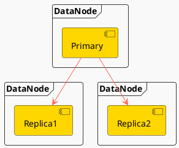
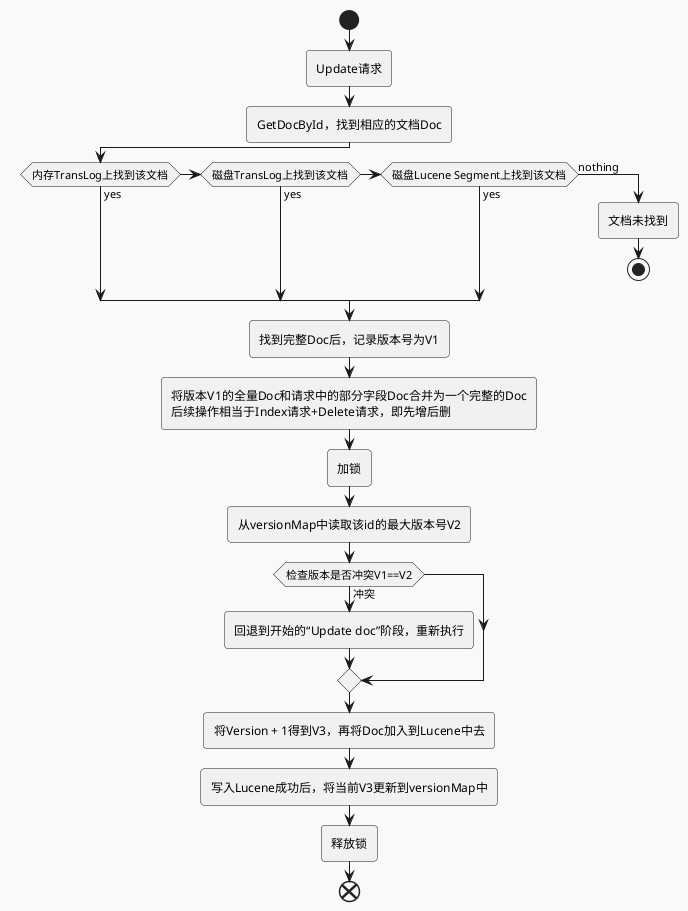

## 写入流程

### 写操作在搜索系统和NoSQL数据库中的对比

- 实时性：
    - 搜索系统的Index一般都是NRT（Near Real Time），近实时的，比如Elasticsearch中，Index的实时性是由refresh控制的，默认是1s，最快可到100ms，那么也就意味着Index doc成功后，需要等待一秒钟后才可以被搜索到。
    - NoSQL数据库的Write基本都是RT（Real Time），实时的，写入成功后，立即是可见的。Elasticsearch中的Index请求也能保证是实时的，因为Get请求会直接读内存中尚未Flush到存储介质的TransLog。
- 可靠性：
    - 搜索系统对可靠性要求都不高，一般数据的可靠性通过将原始数据存储在另一个存储系统来保证，当搜索系统的数据发生丢失时，再从其他存储系统导一份数据过来重新rebuild就可以了。在Elasticsearch中，通过设置TransLog的Flush频率可以控制可靠性，要么是按请求，每次请求都Flush；要么是按时间，每隔一段时间Flush一次。一般为了性能考虑，会设置为每隔5秒或者1分钟Flush一次，Flush间隔时间越长，可靠性就会越低。
    - NoSQL数据库作为一款数据库，必须要有很高的可靠性，数据可靠性是生命底线，决不能有闪失。如果把Elasticsearch当做NoSQL数据库，此时需要设置TransLog的Flush策略为每个请求都要Flush，这样才能保证当前Shard写入成功后，数据能尽量持久化下来。

### 写操作的关键点

- 可靠性：或者是持久性，数据写入系统成功后，数据不会被回滚或丢失。
- 一致性：数据写入成功后，再次查询时必须能保证读取到最新版本的数据，不能读取到旧数据。
- 原子性：一个写入或者更新操作，要么完全成功，要么完全失败，不允许出现中间状态。
- 隔离性：多个写入操作相互不影响。
- 实时性：写入后是否可以立即被查询到。
- 性能：写入性能，吞吐量到底怎么样。

### Elasticsearch的写

#### Replica 副本

Elasticsearch采用多Shard方式，通过配置routing规则将数据分成多个数据子集，每个数据子集提供独立的索引和搜索功能。当写入文档的时候，根据routing规则，将文档发送给特定Shard中建立索引。

Elasticsearch整体架构上采用了一主多副的方式：

每个Index由多个Shard组成，每个Shard有一个主节点和多个副本节点，副本个数可配。但每次写入的时候，写入请求会先根据_routing规则选择发给哪个Shard，Index Request中可以设置使用哪个Filed的值作为路由参数，如果没有设置，则使用Mapping中的配置，如果mapping中也没有配置，则使用_id作为路由参数，然后通过_routing的Hash值选择出Shard（在OperationRouting类中），最后从集群的Meta中找出出该Shard的Primary节点。

请求接着会发送给Primary Shard，在Primary Shard上执行成功后，再从Primary Shard上将请求同时发送给多个Replica Shard，请求在多个Replica Shard上执行成功并返回给Primary Shard后，写入请求执行成功，返回结果给客户端。

这种模式下，写入操作的延时就等于latency = Latency(Primary Write) + Max(Replicas Write)。只要有副本在，写入延时最小也是两次单Shard的写入时延总和，写入效率会较低，但是这样的好处也很明显，避免写入后，单机或磁盘故障导致数据丢失，在数据重要性和性能方面，一般都是优先选择数据，除非一些允许丢数据的特殊场景。

Elasticsearch里为了减少磁盘IO保证读写性能，一般是每隔一段时间（比如5分钟）才会把Lucene的Segment写入磁盘持久化，对于写入内存，但还未Flush到磁盘的Lucene数据，如果发生机器宕机或者掉电，那么内存中的数据也会丢失，这时候Elasticsearch使用TransLog来保证数据不丢失

#### TransLog

对于每一个Shard，写入请求到达该Shard后，先写Lucene文件，创建好索引，此时索引还在内存里面，接着去写TransLog，写完TransLog后，刷新TransLog数据到磁盘上，写磁盘成功后，请求返回给用户。

在写Lucene内存后，需要通过Refresh把内存的对象转成完整的Segment后，然后再次reopen后才能被搜索，一般这个时间设置为1秒钟，导致写入Elasticsearch的文档，最快要1秒钟才可被从搜索到，所以Elasticsearch在搜索方面是NRT（Near Real Time）近实时的系统。而如果写完之后实时使用GetById查询，则可以直接从TransLog中查询到，这时候就成了RT（Real Time）实时系统。

每隔一段比较长的时间，比如30分钟后，Lucene会把内存中生成的新Segment刷新到磁盘上，这时会清空掉旧的TransLog。

#### Update流程

### Client Node

1. Ingest Pipeline
   在这一步可以对原始文档做一些处理，比如HTML解析，自定义的处理，具体处理逻辑可以通过插件来实现。在Elasticsearch中，由于Ingest Pipeline会比较耗费CPU等资源，可以设置专门的Ingest Node，专门用来处理Ingest Pipeline逻辑。如果当前Node不能执行Ingest Pipeline，则会将请求发给另一台可以执行Ingest Pipeline的Node

2. Auto Create Index
   判断当前Index是否存在，如果不存在，则需要自动创建Index，这里需要和Master交互。也可以通过配置关闭自动创建Index的功能

3. Set Routing
   设置路由条件，如果Request中指定了路由条件，则直接使用Request中的Routing，否则使用Mapping中配置的，如果Mapping中无配置，则使用默认的_id字段值。在这一步中，如果没有指定id字段，则会自动生成一个唯一的_id字段，目前使用的是UUID

4. Construct BulkShardRequest
   由于Bulk Request中会包括多个(Index/Update/Delete)请求，这些请求根据routing可能会落在多个Shard上执行，这一步会按Shard挑拣Single Write Request，同一个Shard中的请求聚集在一起，构建BulkShardRequest，每个BulkShardRequest对应一个Shard

5. Send Request To Primary
   这一步会将每一个BulkShardRequest请求发送给相应Shard的Primary Node

### Primary Node 

> `PrimaryOperationTransportHandler.messageReceived`

##### 1. Index or Update or Delete

循环执行每个Single Write Request，对于每个Request，根据操作类型(CREATE/INDEX/UPDATE/DELETE)选择不同的处理逻辑。其中，Create/Index是直接新增Doc，Delete是直接根据_id删除Doc

##### 2. Translate Update To Index or Delete

这一步是Update操作的特有步骤，在这里，会将Update请求转换为Index或者Delete请求。首先，会通过GetRequest查询到已经存在的同_id Doc（如果有）的完整字段和值（依赖_source字段），然后和请求中的Doc合并。同时，这里会获取到读到的Doc版本号，记做V1

##### 3. Parse Doc

这里会解析Doc中各个字段。生成ParsedDocument对象，同时会生成uid Term

##### 4. Update Mapping
   
Elasticsearch中有个自动更新Mapping的功能，就在这一步生效。会先挑选出Mapping中未包含的新Field，然后判断是否运行自动更新Mapping，如果允许，则更新Mapping

##### 5. Get Sequence Id and Version

由于当前是Primary Shard，则会从SequenceNumber Service获取一个sequenceID和Version。SequenceID在Shard级别每次递增1，SequenceID在写入Doc成功后，会用来初始化LocalCheckpoint。Version则是根据当前Doc的最大Version递增1

##### 6. Add Doc To Lucene

这一步开始的时候会给特定_uid加锁，然后判断该_uid对应的Version是否等于之前Translate Update To Index步骤里获取到的Version，如果不相等，则说明刚才读取Doc后，该Doc发生了变化，出现了版本冲突，这时候会抛出一个VersionConflict的异常，该异常会在Primary Node最开始处捕获，重新从“Translate Update To Index or Delete”开始执行

如果Version相等，则继续执行，如果已经存在同id的Doc，则会调用Lucene的UpdateDocument(uid, doc)接口，先根据uid删除Doc，然后再Index新Doc。如果是首次写入，则直接调用Lucene的AddDocument接口完成Doc的Index，AddDocument也是通过UpdateDocument实现

这里如何保证Delete-Then-Add的原子性，怎么避免中间状态时被Refresh？答案是在开始Delete之前，会加一个Refresh Lock，禁止被Refresh，只有等Add完后释放了Refresh Lock后才能被Refresh，这样就保证了Delete-Then-Add的原子性

##### 7. Write Translog
    
写完Lucene的Segment后，会以keyvalue的形式写TransLog，Key是_id，Value是Doc内容。当查询的时候，如果请求是GetDocByID，则可以直接根据_id从TransLog中读取到，满足NoSQL场景下的实时性要去。这一步的最后，会标记当前SequenceID已经成功执行，接着会更新当前Shard的LocalCheckPoint

##### 8. Renew Bulk Request
   
这里会重新构造Bulk Request

##### 9. Flush Translog
    
这里会根据TransLog的策略，选择不同的执行方式，要么是立即Flush到磁盘，要么是等到以后再Flush。Flush的频率越高，可靠性越高，对写入性能影响越大

##### 10. Send Requests To Replicas
    
这里会将刚才构造的新的Bulk Request并行发送给多个Replica，然后等待Replica的返回，这里需要等待所有Replica返回后（可能有成功，也有可能失败），Primary Node才会返回用户。如果某个Replica失败了，则Primary会给Master发送一个Remove Shard请求，要求Master将该Replica Shard从可用节点中移除。同时会将SequenceID，PrimaryTerm，GlobalCheckPoint等传递给Replica

发送给Replica的请求中，Action Name等于原始ActionName + [R]，这里的R表示Replica。通过这个[R]的不同，可以找到处理Replica请求的Handler

##### 11. Receive Response From Replicas
    
Replica中请求都处理完后，会更新Primary Node的LocalCheckPoint

### Replica Node 

> `ReplicaOperationTransportHandler.messageReceived`

##### 1. Index or Delete

##### 2. Parse Doc

##### 3. Update Mapping

##### 4. Get Sequence Id and Version

Primary Node中会生成Sequence ID和Version，然后放入ReplicaRequest中，这里只需要从Request中获取到就行

##### 5. Add Doc To Lucene

##### 6. Write Translog

##### 7. Flush Translog

### 写操作的关键点

- 可靠性：由于Lucene的设计中不考虑可靠性，在Elasticsearch中通过Replica和TransLog两套机制保证数据的可靠性。
- 一致性：Lucene中的Flush锁只保证Update接口里面Delete和Add中间不会Flush，但是Add完成后仍然有可能立即发生Flush，导致Segment可读。这样就没法保证Primary和所有其他Replica可以同一时间Flush，就会出现查询不稳定的情况，这里只能实现最终一致性。
- 原子性：Add和Delete都是直接调用Lucene的接口，是原子的。当部分更新时，使用Version和锁保证更新是原子的。
- 隔离性：仍然采用Version和局部锁来保证更新的是特定版本的数据。
- 实时性：使用定期Refresh Segment到内存，并且Reopen Segment方式保证搜索可以在较短时间（比如1秒）内被搜索到。通过将未刷新到磁盘数据记入TransLog，保证对未提交数据可以通过ID实时访问到。
- 性能：一是不需要所有Replica都返回后才能返回给用户，只需要返回特定数目的就行；二是生成的Segment先在内存中提供服务，等一段时间后才刷新到磁盘，Segment在内存这段时间的可靠性由TransLog保证；三是TransLog可以配置为周期性的Flush，但这个会给可靠性带来伤害；四是每个线程持有一个Segment，多线程时相互不影响，相互独立，性能更好；五是系统的写入流程对版本依赖较重，读取频率较高，因此采用了versionMap，减少热点数据的多次磁盘IO开销。
