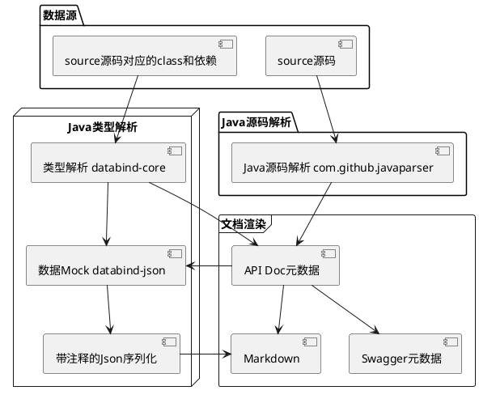

## 一、概述
> 基于java源码中的注释(不限于多行或单行)和泛型解析，来生成api文档元数据和具体文档输出的工具
> 
> 只需要指定想要解析的接口源码目录，并保证接口涉及的所有类都包含在classpath下，然后再设置渲染方式，最后运行便可获得最终结果
> 
> 目前支持json-with-comment 和 swagger-editor两种输出方式

## 二、实现原理


## 三、接入姿势

### 3.1 项目侵入式接入
可以编写单元测试或单独的模块来接入

#### 3.1.1 gradle 依赖引入
```groovy
repositories {
    maven { url 'https://oss.sonatype.org/content/repositories/snapshots/' }
}

testImplementation 'org.dreamcat:apidoc-generator:0.1-SNAPSHOT'
```

#### 3.1.2 maven 依赖引入
```xml
<project>
  <repository>
    <id>snapshots-repo</id>
    <url>https://oss.sonatype.org/content/repositories/snapshots</url>
    <releases><enabled>false</enabled></releases>
    <snapshots><enabled>true</enabled></snapshots>
  </repository>

  <dependency>
    <groupId>org.dreamcat</groupId>
    <artifactId>apidoc-generator</artifactId>
    <version>0.1-SNAPSHOT</version>
    <scope>test</scope>
  </dependency>
</project>
```

#### 3.1.3 单元测试示例

**源码样例**
```java
public interface ComplexService {

    // list complex
    ApiResult<ApiPageSummary<ComplexModel, ComplexSummaryModel>> list(ComplexListParam param);

    /**
     * create complex
     *
     * @param param require param to create complex
     * @param file attachment
     * @return complex id
     */
    ApiResult<String> create(ComplexCreateParam param, byte[] file);
}
```

```java
public class ComplexListParam extends PageParam {

    private String token; // the token to sign
    private Set<Integer> userIds; // users who admire the number
}
```

**单元测试**
```java
import java.util.Collections;
import org.dreamcat.cli.generator.apidoc.ApiDocConfig;
import org.dreamcat.cli.generator.apidoc.ApiDocGenerator;
import org.dreamcat.cli.generator.apidoc.renderer.JsonWithCommentRenderer;
import org.junit.jupiter.api.Test;

class JavaDocTest {

    @Test
    void test() throws Exception {
        String srcDir = "/path/to/project/src/main/java";
        // 想要分析的Service接口的源码目录
        String javaFileDir = srcDir + "/com/example/service";
        // 支持源码分析的java基础包名
        String basePackage = "com.example";

        // API文档生成器的配置
        ApiDocConfig config = new ApiDocConfig();
        config.setBasePackages(Collections.singletonList(basePackage));
        config.setSrcDirs(Collections.singletonList(srcDir));
        config.setJavaFileDirs(Collections.singletonList(javaFileDir));
        
        // 第一种输出：设置渲染方式为带注释的Json markdown格式
        JsonWithCommentRenderer jsonWithCommentRenderer = new JsonWithCommentRenderer(config);
        jsonWithCommentRenderer.setSeqFormatter(i -> "#### 4.1." + i);
        
        ApiDocGenerator<String> markdownGenerator = new ApiDocGenerator<>(config, jsonWithCommentRenderer);
        String markdown = markdownGenerator.generate();
        System.out.println(markdown);
        
        // 第二种输出：设置渲染方式为swagger-editor yaml格式
        SwaggerRenderer swaggerRenderer = new SwaggerRenderer();
        swaggerRenderer.setdDfaultTitle("Some Stuff");

        ApiDocGenerator<String> yamlGenerator = new ApiDocGenerator<>(config, swaggerRenderer);
        String yaml = yamlGenerator.generate();
        System.out.println(yaml);
    }
}
```

## 四、输出姿势

### 4.1 带注释的Json Markdown文档输出

示例如下

#### 4.1.1  list complex
入参
```js
{
    "pageNo": 1616467239, //  page number, default is 1
    "pageSize": 1187568143, //  page size, default is 10
    "token": "05Ie60000000", //  the token to sign
    "userIds": [
        1360046618
    ] //  users who admire the number
}
```

出参
```js
{
    "code": "Z14dx00", //  response code
    "msg": "6d1B", //  error message
    "data": {
        "pageNo": 332708021, //  page number, default is 1
        "pageSize": 1363282705, //  page size, default is 10
        "list": [
            {
                "id": "0HN5X", // /! entity id
                "createdBy": 7819338319132650901, //     who created the record    
                "createdAt": "2021-12-20 20:18:56", // 
                "a": 2114287267, //  a or a + bi
                "b": 1421927723, //  b of a + bi
                "salt": [
                    3
                ], //  salt to sign 
                "admired": [
                    {
                        "id": 6733097960264216561,
                        "name": "2O9eO000000000",
                        "gender": female
                    }
                ] //      * the people who admire the number     
            }
        ], //  the list data per page
        "totalCount": 1593462666, //  the total count
        "totalPage": 585256653, //  the total page
        "summary": {
            "todayCount": 940383353038686031, //  count of today
            "last7dayCount": 2958055079033281580, //  count of last 7 day
            "bits": [
                367530979
            ] //  magic bits
        } //  the summary per page
    } //  real data
}
```

#### 4.1.2  create complex
入参
```js
{
    "a": 15466019106679717788876966621497800342, //  some of complex
    "b": 1.14164135352093225954791023656452E+616, //  some of complex
    "props": {
        "Q14iG0000": "VWsEa00000"
    } //  props for extra settings 
}
```

出参
```js
{
    "code": "k", //  response code
    "msg": "7RwO600", //  error message
    "data": "OgF6" //  real data
}
```

### 4.2 Swagger Editor Yaml文档输出

示例如下

```yaml
---
swagger: "2.0"
info:
  version: "1.0.0"
  title: "Default Title"
tags:
- name: "com.example.controller.ComplexController"
  description: ""
schemes:
- "https"
- "http"
paths:
  /api/v1/get:
    get:
      tags:
      - "com.example.controller.ComplexController"
      description: "get complex"
      operationId: "GET_get"
      parameters:
      - in: "query"
        name: "id"
        description: ""
        required: true
        type: "string"
      responses:
        "200":
          description: "ApiResult<ComplexModel>"
          schema:
            $ref: "#/definitions/ApiResult_ComplexModel"
definitions:
  ApiResult_ComplexModel:
    type: "object"
    properties:
      msg:
        type: "string"
      data:
        type: "object"
        properties:
          admired:
            type: "array"
            items:
              type: "object"
              properties:
                name:
                  type: "string"
                gender:
                  type: "string"
                  enum:
                  - "unknown"
                  - "female"
                  - "male"
                id:
                  type: "object"
                  format: "int64"
          createdAt:
            type: "object"
            format: "date-time"
          a:
            type: "object"
            format: "int32"
          b:
            type: "integer"
            format: "int32"
          salt:
            type: "array"
            items:
              type: "object"
          createdBy:
            type: "integer"
            format: "int64"
          id:
            type: "string"
      code:
        type: "string"
```
