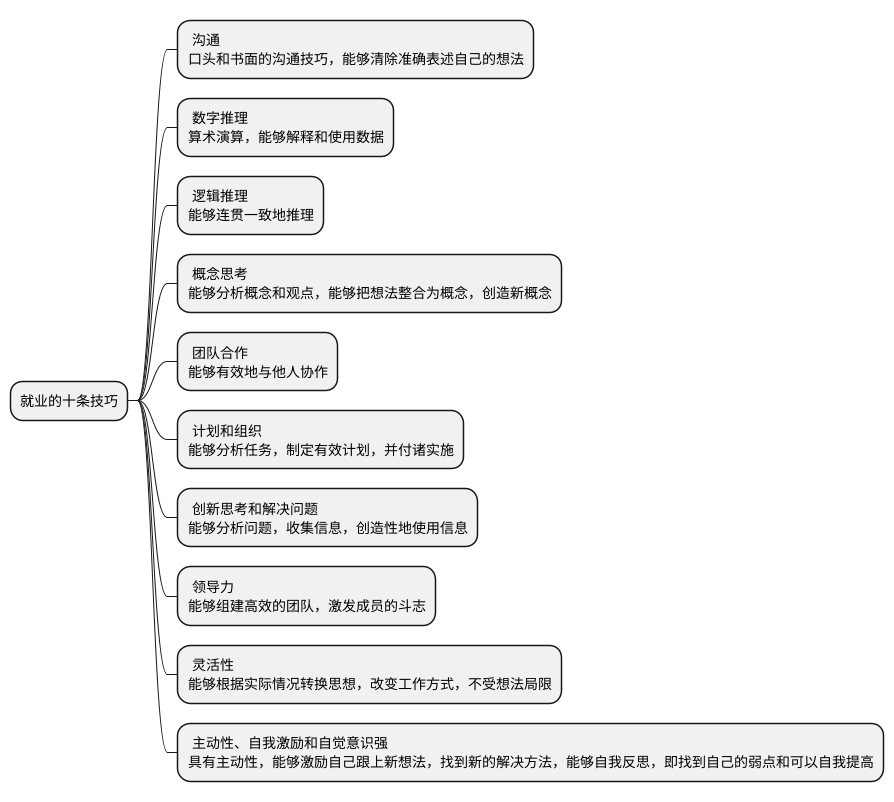
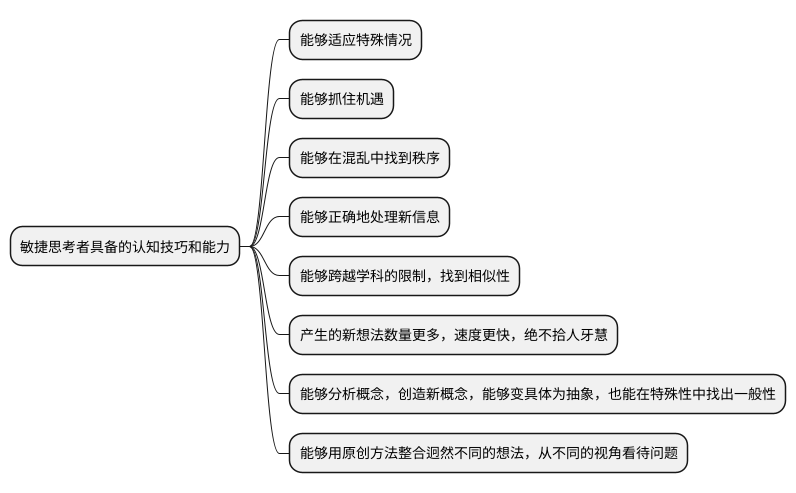

```plantuml
@startmindmap

* 就业的十条技巧
**: 沟通
口头和书面的沟通技巧，能够清除准确表述自己的想法;
**: 数字推理
算术演算，能够解释和使用数据;
**: 逻辑推理
能够连贯一致地推理;
**: 概念思考
能够分析概念和观点，能够把想法整合为概念，创造新概念;
**: 团队合作
能够有效地与他人协作;
**: 计划和组织
能够分析任务，制定有效计划，并付诸实施;
**: 创新思考和解决问题
能够分析问题，收集信息，创造性地使用信息;
**: 领导力
能够组建高效的团队，激发成员的斗志;
**: 灵活性
能够根据实际情况转换思想，改变工作方式，不受想法局限;
**: 主动性、自我激励和自觉意识强
具有主动性，能够激励自己跟上新想法，找到新的解决方法，能够自我反思，即找到自己的弱点和可以自我提高;
@endmindmap
```

```plantuml
@startmindmap
* 敏捷思考者具备的认知技巧和能力
** 能够适应特殊情况
** 能够抓住机遇
** 能够在混乱中找到秩序
** 能够正确地处理新信息
** 能够跨越学科的限制，找到相似性
** 产生的新想法数量更多，速度更快，绝不拾人牙慧
** 能够分析概念，创造新概念，能够变具体为抽象，也能在特殊性中找出一般性
** 能够用原创方法整合迥然不同的想法，从不同的视角看待问题
@endmindmap
```

