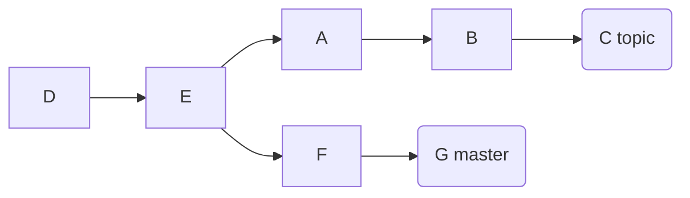

---
title: "Git Checkout"
---

## branch

```shell
# list all branch, include local and remote
git branch -a
# delete branch
git branch -d <local_branch>
git push origin --delete <remote_branch>

# list tags
git log --pretty=oneline --abbrev-commit
git show <tag_name>
# tag a tag based on a commit, default cid is `HEAD`
git tag <tag_name> <commit_id>
git tag -a <tag_name> -m "message for tag" <commit_id>

# dangerous operation, it's better no-modification until checkout to `HEAD` 
git checkout <tag_name>
# 
git checkout -b <bra_name> <tag_name>

git tag -l "<prefix>*"
git push origin <tag_name>
# push all tags
git push origin --tags

# delete a local tag
git tag -d <tag_name>
# delete a remote tag
git push origin :refs/tags/<tag_name>
```

## stash

```shell
# list the stash entries that you currently have. stash@{0} is the latest entry
git stash list
# save all uncommitted changes
git stash
# apply all uncommitted changes
git stash apply
```

## merge-base

```shell
git merge-base origin/master HEAD
```

## rebase

```shell
# Assume the following history exists and the current branch is "topic":
#       A - B - C topic
#      /  
# D - E - F -G master

git switch topic
git rebase master
git rebase master topic

# would be
#               A'--B'--C' topic
#              /
# D---E---F---G master
```



```shell
mkdir git-repo && cd git-repo
git init --bare
export remote_url=$(pwd)

cd ..
git clone $remote_url git
cd git

# D
echo $(uuidgen) > D && git add . && git commit -m 'D' && git push -u origin master
# D - E
echo $(uuidgen) > E && git add . && git commit -m 'E' && git push -u origin master

git checkout -b topic
git switch master
# D - E - F
echo $(uuidgen) > F && git add . && git commit -m 'F' && git push -u origin master
# D - E - F - G
echo $(uuidgen) > G && git add . && git commit -m 'G' && git push -u origin master

git switch topic
#       A
#      /  
# D - E - F
echo $(uuidgen) > A && git add . && git commit -m 'A' && git push -u origin topic
#       A - B
#      /  
# D - E - F
echo $(uuidgen) > B && git add . && git commit -m 'B' && git push -u origin topic
#       A - B - C topic
#      /  
# D - E - F master
echo $(uuidgen) > C && git add . && git commit -m 'C' && git push -u origin topic
```

## revert

```shell
# revert to previous commit
git revert <previous-commit>
```

## reset

```shell
# discard changes and reset files to master
git reset --hard origin/master

git reset --hard HEAD
# or save changes
git reset --soft HEAD 

# discard changes and reset to current branch
git checkout . && git clean -xdf
```
