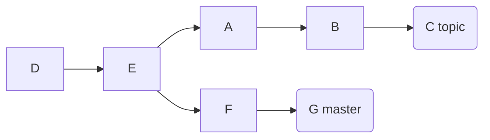

---
title: "Git Rebase"
---

## rebase

```shell
# Assume the following history exists and the current branch is "topic":
#       A - B - C topic
#      /  
# D - E - F -G master

git switch topic
git rebase master
git rebase master topic

# would be
#               A'--B'--C' topic
#              /
# D---E---F---G master
```

## branch rebase



```shell
mkdir git-repo && cd git-repo
git init --bare
export remote_url=$(pwd)

cd ..
git clone $remote_url git
cd git

# D
echo $(uuidgen) > D && git add . && git commit -m 'D' && git push -u origin master
# D - E
echo $(uuidgen) > E && git add . && git commit -m 'E' && git push -u origin master

git checkout -b topic
git switch master
# D - E - F
echo $(uuidgen) > F && git add . && git commit -m 'F' && git push -u origin master
# D - E - F - G
echo $(uuidgen) > G && git add . && git commit -m 'G' && git push -u origin master

git switch topic
#       A
#      /  
# D - E - F
echo $(uuidgen) > A && git add . && git commit -m 'A' && git push -u origin topic
#       A - B
#      /  
# D - E - F
echo $(uuidgen) > B && git add . && git commit -m 'B' && git push -u origin topic
#       A - B - C topic
#      /  
# D - E - F master
echo $(uuidgen) > C && git add . && git commit -m 'C' && git push -u origin topic
```
